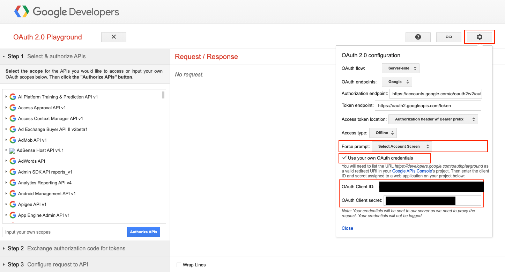
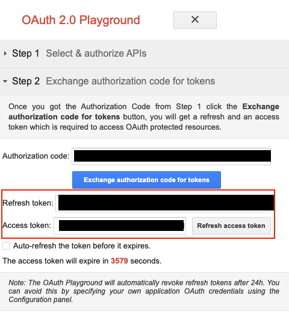
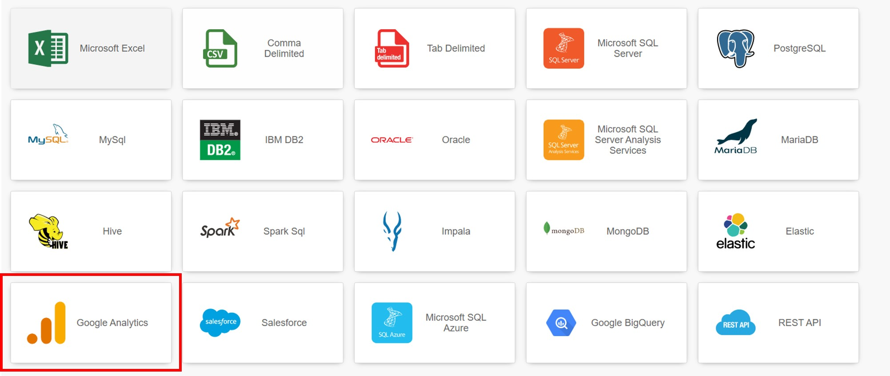
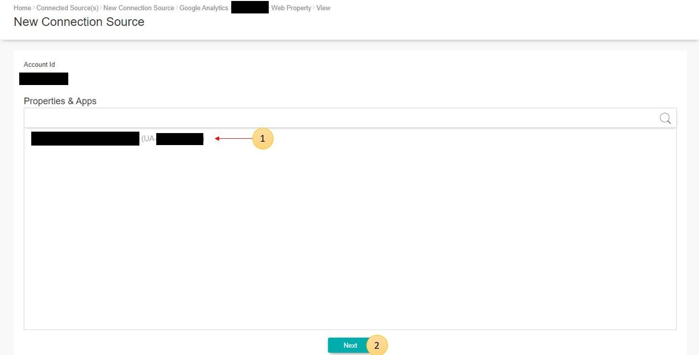
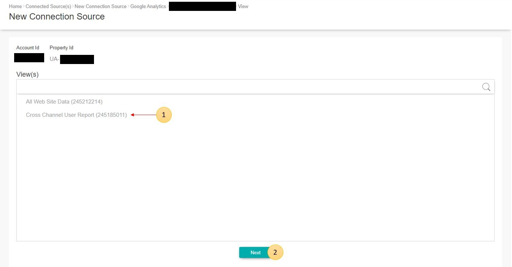
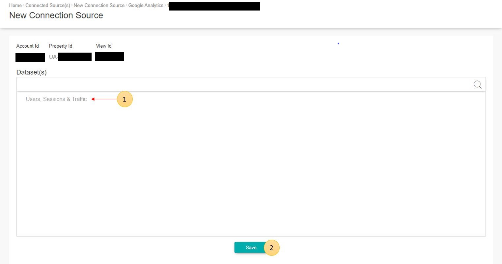

# Google Analytics Connector Guide

This documentation provides guidance to obtain Google Analytics Account ID, and to setup Google Analytics OAuth credential in order to connect to Google Analytics via GIANT as a connector.

# Prerequisite
- GIANT account with permission create connection source
- Google account with
    - Google Analytics Account
    - Permission to create credential - client ID

# 1. Obtaining Google Analytics Account ID
## Obtain Google Analytics Account ID 
1. Login to Google Analytics Platform. 
2. Expand the **Accounts** breakdown on the top left panel. 
3. Navigate to your preferred Account and obtain the **Account ID** under **Analytics Accounts** tab.

# 2. Preparation for Google Analytics OAuth Credential
## Create Google Credential - OAuth Client ID
1. Login to Google Cloud Platform.
2. Navigate to **Credentials** under **APIs & Services**
3. Click the **Create credentials** button and choose **OAuth client ID**.
4. Under **Application type**, select **Web application**.
5. Enter name for this client ID. Example GIANT Google Analytics.
6. Enter GIANT URL into **Authorised JavaScript origins**. 
7. Add GIANT URL and [**Google OAuth 2.0 Playground**](https://developers.google.com/oauthplayground) into **Authorised redirect URIs**. 
8. Click **Create** button. Upon success create, the new client ID is show at the Credential page.
9. Navigate into the new OAuth Client ID to get the **Client ID** & **Client secret**. 

## Generate refresh token
1. Go to [**Google OAuth 2.0 Playground**](https://developers.google.com/oauthplayground/).
2. Click **OAuth 2.0 Configuration** icon button at the top right. OAuth 2.0 configuration box will be popout.
3. Select `Select Account Screen` at **Force prompt**.
4. Check the **Use your own OAuth credentials**. 
5. Enter the **OAuth Client ID** & **OAuth Client Secret**.

6. Under **Step 1 Select & authorize APIs**, find **Analytics Reporting API v4**. Tick the following. 
7. Navigate to **Google Analytics API v3**. Tick the following. 
8. Click the **Authorize APIs** button to proceed. It will redirect to authorization page, continue to allow the Google Analytics permission for GIANT. Once complete, you will be redirect back to the **OAuth 2.0 Playground** page.
9. Notice the page will show you Step 2 with **Authorization code** available. Click the **Exchange authorization code for tokens** button. 
10. **Refresh token** and **Access token** are ready. 

# 3. Enable Google Analytics API and Google Analytics Reporting API
1. Go to [**Google Cloud Platform APIs & Services Page**](https://console.cloud.google.com/apis/dashboard).
2. Click **ENABLE APIS AND SERVICES** button at the top left. 
3. You will be redirected to Google API Library page. Search **Google Analytics** in the search bar and these API options will be displayed on your page. 
4. Click on **Google Analytics Reporting API** and click on the **ENABLE** button to enable the Analytics Reporting API. 
5. Next, click on **Google Analytics API** and click on the **ENABLE** button to enable the Analytics API. 
6. You have successfully enabled the Google Analytics API needed to create and use Google Analytics connection source in GIANT. 

# 4. Create Google Analytics connection source in GIANT
1. Go to GIANT new connection source add page. Select Google Analytics.

2. Fill in all the information obtain from above. 
3. After filling in all details, click **Connect** to connect to the server. 
4. The system will lead you to the Properties & Apps selection page. 
5. Select the Property you would like to connect to and click **Next**.
6. The system will lead you to the View(s) selection page. 
7. Select the View you would like to connect to and click **Next**.
8. The system will lead you to the Dataset(s) selection page. 
9. Select the dataset you would like to connect to and click **Save**.
10. You have successfully created Google Analytics connection source in GIANT. 
