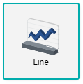
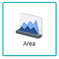
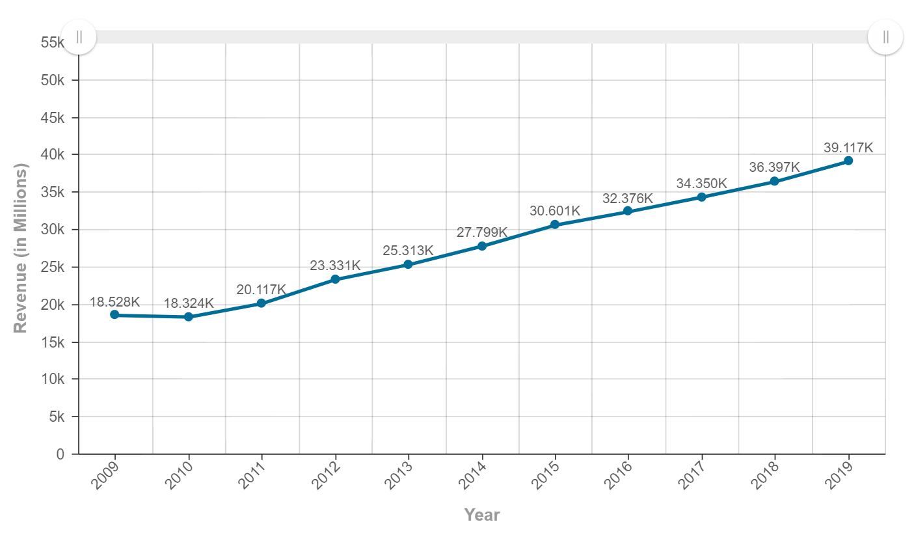
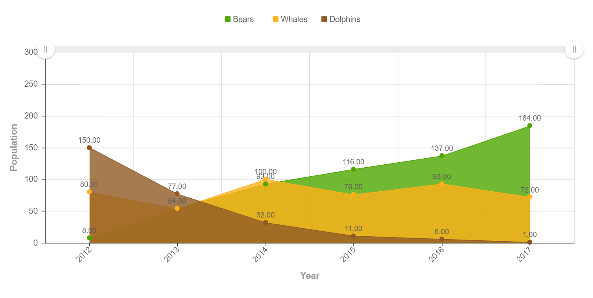

## Line and Area Chart

 

A Line/Area graph is a representation of a trend (Line Chart) or comparative totals (Area Chart) over time, often in chronological order. They are both similar in the sense that their data would be displayed with an initial line to represent their values throughout the timeline, having the differences of the chart being only a line (Line Chart) or having a filled area under the line (Area Chart), thus making the chart very interchangeable among the two. These two charts are used to show the trend or comparison between the categories of data, where analysts can take note of the change within the patterns of the data to provide on strategies based on the change.

## Data Binding

For both line and area charts, there are only two mandatory bindings to generate the chart which are the **X-Axis** and **Y-Axis**. However, for Area chart analysis to make sense, the **Group** field should also be binded. For Line chart, the **Group** field binding may be added if necessary and depending on the analysis type required. Data Type that needs to be fulfilled for the bindings are as below:

|Bindings|Data Type|
|---|---|
|X-Axis|Text, Date|
|Y-Axis|Numeric|
|Group|Category (Text or Date)|

### X-Axis

A field with Text or Date data type can be used for **X-Axis** binding. This will be displayed as the Category values.

### Y-Axis

A field with Numeric data type can be used for **Y-Axis** binding. This will display the measurement of the values.

### Group

The **Group** binding determines the category to use to group **X-Axis** values in the chart. It can be a Date or Text data type.

## Other Settings

### All/Top/Bottom

By default, the option selected is All (which means, all the data points will be shown in the chart). Select Top or Bottom, followed by the number of data points required to show the selected number of top-most data rows **OR** selected number of bottom-most data rows.

### Drill Down

If your data contains hierarchy (for example: Region > Country > State), you can use this field to drill down your data from the highest level to the lower levels.

### Sort

You can use this setting to arrange your data points based on the field that you need. For example, to sort by Country in ascending order.

### Filter

Add filters to restrict your data so that analysis will be focused on data which are shown in the chart.

## Use Cases
### Nike Revenue Sales from 2009 to 2019 (Line Chart)
A dataset by Nike is used to display their revenue sales from the year of 2009 to 2019. A line chart will be used to display the data. Download sample data [here](./sample-data/area-line-graph/nike-revenue-worldwide.xlsx).

Provided within the dataset are the necessary fields needed to generate the line chart. As the only bindings needed to produce the chart are **X-Axis** and **Y-Axis**, the **Year** and **Revenue (in Millions)** column fields are used to fill in those bindings respectively.

|Bindings|Select|
|---|---|
|X-Axis|Year|
|Y-Axis|Revenue (in Millions)|

The line graph shows a steady increase in revenue from its initial point to its end point. This means that Nike has a constant growth in their revenue as the years pass on. Their highest revenue is in the year of 2019, where they earned US$39.117 million. This is an 8.3% increase in revenue as compared to 2018, where they collected US$36.397 million. As the revenue is on a steady path of increase, Nike can continue their current marketing and business plans for the future as the data shows that their marketing campaigns had been successful in generating a steady sales.

**Output**

### Wildlife Population throughout the Years (Area Chart)
A sample Wildlife Population dataset is used for the area chart, whereby the total number of 3 animals (Bears, Dolphins and Whales) sighted at the selected research venue are displayed throughout the years of 2012 to 2017. The area chart is suitable to display the data in a grouped format, which makes comparison easier for analysis. Download sample data [here](./sample-data/area-line-graph/Wildlife_Population.xlsx).

Provided within the dataset are the necessary fields needed to generate the area graph. The **Year** field will be placed in the **X-Axis** setting, whereas the **Population** field will be placed in the **Y-Axis** setting. As there are multiple animals listed within the dataset, the **Animals** columns is used for the **Group** field setting.

|Bindings|Select|
|---|---|
|X-Axis|Year|
|Y-Axis|Population|
|Group|Animals|

The chart shows the total number of respective wildlife animals sighted during each year of sampling at the selected research area, whereby each of the animals has a varied counts throughout the years. The number of **Bears** sighted by researchers has an increase in count throughout the years, as opposed to the number of **Dolphins** sighted which are steadily declining year after year. However, the number of **Whales** sighted fluctuated throughout the years of 2012 to 2017.

**Output**

**Analysis**

From the use case, it gives us an idea of the survival status for the three different animals within the years of 2012 to 2017, in the area where the research was conducted. Overall, the highest number of wildlife sighting is **Bears** with a count of 184 in the year 2017, whereby it also has an increasing trend from the year 2012. As for **Dolphins**, the number of sighting drastically decreases within the timeline of 2012 to 2017, which is something to be worried about. Having the count of only 1 in the year of 2017 from the highest count of 150 in the year 2012, this indicates that either the **Dolphins** are becoming extinct in the area of research **OR** they have chosen to migrate to another area due to external factors such as pollution, rise in the sea water temperature or threat. The number of sightings for **Whales** fluctuated from year to year, with the count ranging from 54 - 100. By analysing this graph, wildlife conservation organisations can take the initiative to focus more efforts on protecting the **Dolphins** due to their extreme low count as of 2017, finding methods to save their habitat to make it more favourable for **Dolphins** in the future. The same can be said for the **Whales** as the inconsistent numbers shows that certain measures need to be taken to protect them. As for the **Bears**, the increasing trend shows that conservation methods are working in preserving the numbers and they should be maintained.
