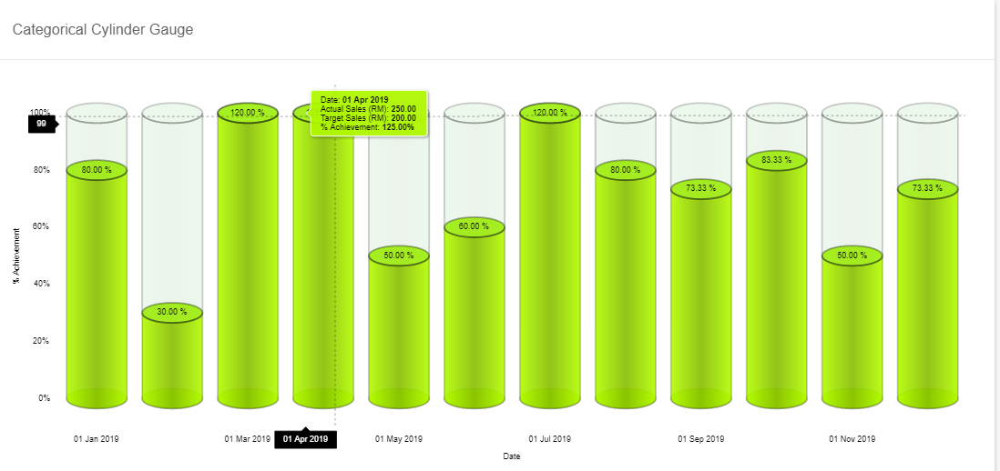
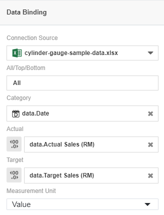
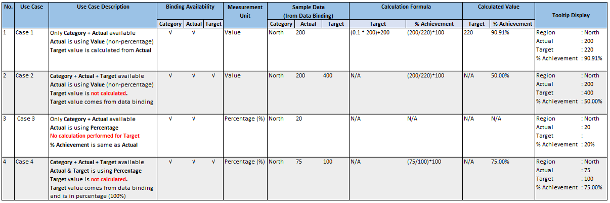
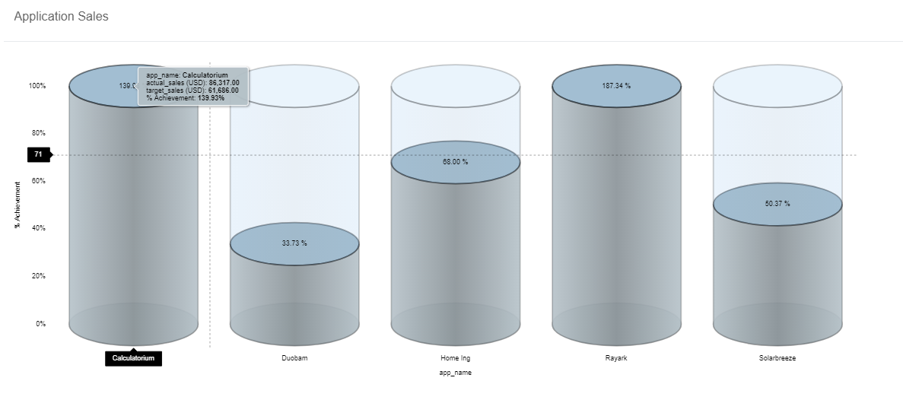
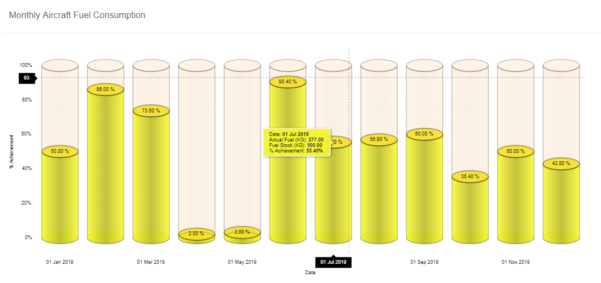

# Categorical Cylinder Gauge
Categorical cylinder gauge is similar to the cylinder gauge, but instead of only one big cylinder it has multiple cylinders for data comparison, just like a column chart. When you have to compare percentage achievement between the categorical values, this chart is recommended for use.

## Diagram Design / Configuration

### Binding

- The mandatory bindings are `Category` and `Actual`

    - `Category` shows a name for a certain category.

    - `Actual` stores the actual values of the categories.

    - For `Measurement Type`, choose the option `Value` if the `Actual` and `Target` values are using the `actual amount`. If you're binding only `Actual field` using a `percentage amount`, select the option `Percentage`.

- The optional binding is `Target`

    - `Target` stores the target values of the categories and can be auto-generated with specific scenario

### Calculation Scenario & Data Generated for Chart Visualization

  
The above use cases shows that based on the values bound from the data source and the `Measurement Type` setting, the `Target` and `% Achievement` can be automatically calculated. You need to ensure that the data you use matches with the `Measurement Type` setting in order to get the correct values to be displayed in the chart.

## Use cases

### Sales Performance of Software Applications

Download sample data [here](./sample-data/categorical-cylinder-gauge/categorical-cylinder-gauge-sample-data-app-sale.csv).

This use case illustrates the total sales and total target sales for each software developed by an IT company. Based on the overall percentage sales achievement, two softwares namely the Calculatorium and Rayark exceeded the target sales. The Sales Team will need to improve their marketing plan for the software Duobam as the overall percentage achivement is less than 50%.

### Monthly Aircraft Fuel Consumption

Download sample data [here](./sample-data/categorical-cylinder-gauge/categorical-cylinder-gauge-sample-data-monthly-fuel.xlsx).

This use case involves the comparison of the monthly fuel consumption of a new aircraft that an airline company had just purchased. The fuel consumption correlates directly with the total time spent on travelling. This means that low overall fuel consumption indicates that the utilization of the aircraft is low. From the historical data, there were only two out of 12 months that the overall fuel consumption was above 80%. From this, it can be concluded that the newly-purchased aircraft usage is low and some actions need to be taken to increase the aircraft's usage to maximize the company's profit.

