# Getting started
This is a code snippet to help you build your own visual pack.

## Prerequisite
* Visual pack knowledge

## Quadrant properties HTML structure

Break into 2 part, ``data`` and ``style`` tab.

```html
<div class="quadrant-properties quadrant-properties--data" tab="data">
    <div class="quadrant-properties__databind">
        <section class="quadrant-properties__collapsible">
            <input type="checkbox" class="quadrant-properties__collapsible-toggle" id="quadrant-properties__collapsible__data-binding" checked />
            <label class="quadrant-properties__collapsible__label" for="quadrant-properties__collapsible__data-binding" data-bind="textMessage: 'qpDataBinding'"> </label>
            <div class="quadrant-properties__collapsible__content">
                <quadrant-control params="controlType: 'connectionSource',
                                        quadrantViewModel: quadrantViewModel">
                </quadrant-control>
				
				<div class="quadrant-properties__seperator"></div>

				<!-- quadrant properties data control code below -->
                
            </div>
        </section>
    </div>
</div>

<div class="quadrant-properties quadrant-properties--style" tab="style">
    <div class="quadrant-properties__databind">
        <section class="quadrant-properties__collapsible">
            <input type="checkbox" class="quadrant-properties__collapsible-toggle" id="quadrant-properties__collapsible__myCustomStyling" />
            <label class="quadrant-properties__collapsible__label" for="quadrant-properties__collapsible__myCustomStyling" data-bind="textMessage: 'My Custom Styling'"></label>
            <div class="quadrant-properties__collapsible__content">
            <!-- quadrant properties style control code below -->
            </div>
        </section>
    </div>
</div>
```

For add new collapsible section, use the below code snippet and replace ``myNewCollapsiblePanel`` and ``My New Collapsible Panel`` with your own name.

```html
<section class="quadrant-properties__collapsible">
            <input type="checkbox" class="quadrant-properties__collapsible-toggle" id="quadrant-properties__collapsible__myNewCollapsiblePanel" />
            <label class="quadrant-properties__collapsible__label" for="quadrant-properties__collapsible__myNewCollapsiblePanel" data-bind="textMessage: 'My New Collapsible Panel'"></label>
            <div class="quadrant-properties__collapsible__content">
            <!-- quadrant properties control code below -->
            </div>
        </section>
```


## Quadrant Controls

These files define the quadrant controls presented on the quadrant-properties panel. Here are some frequently used controls:

- [single dimension binding](#single-dimension-binding)
- [single measurement binding](#single-measurement-binding)
- [decimal setting](#decimal)
- [multiple paths binding](#multiple-paths-binding)
- [separator](#separator)
- [textbox](#textbox)
- [select/drop-down-list](#select/drop-down-list)
- [switch](#switch)
- [top and bottom filter](#top-bottom-filter)
- [sort](#sort)
- [filter](#filter)
- [cross chart filter](#cross-chart-filter)
- [hide header](#hide-header)
- [color palette](#color-palette)
- [color picker](#color-picker)
- [drill down](#drill-down)


#### single dimension binding

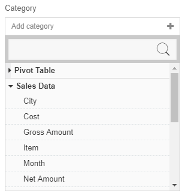

- `labelKey` defines the label presented above the control.
- `addLabelKey` defines the placeholder label in the control before anything gets selected.
- `excludedBindings` defines the bindings to be excluded after they have been selected somewhere else.
- `selectedBindingContext` defines the currently selected binding and is updated when the user changes the binding.
- `*Binding` define the methods that are called to add, delete and update the binding in Visual parameters.

```html
<quadrant-control params="
    controlType: 'singleBinding',
    labelKey: 'Category',
    addLabelKey: 'Add category',
    bindingType: 'dimension',
    selectedConnectionSource : selectedConnectionSource,
    selectedBindingContext: categoryPathBindingContext,
    addBinding : addCategoryPath,
    deleteBinding: deleteCategoryPath,
    updateBinding: updateCategoryPath">
</quadrant-control>
```

```javascript
var observable = ko.observable;
var computed = ko.computed;
var getBindingName = fxUtil.bindingName;
var bindingPropertyType = fxUtil.bindingPropertyType;
var fxUnwrap = fxUtil.unwrap;
var isDimension = fxUtil.isDimension;

var fxQuadrant = params.quadrantViewModel;
var refreshQuadrant = fxQuadrant.refreshQuadrant;
var quadrantComposer = fxQuadrant.quadrantComposer;
var projectionEntityManager = quadrantComposer.projectionEntityManager;
var koProjections = projectionEntityManager.entities;
var koSource = quadrantComposer.source;
var koVisual = quadrantComposer.visual;

var koDimensions = koProjections.filter(isDimension);
var projectionEntityManagerPush = projectionEntityManager.push.bind(projectionEntityManager);
var projectionEntityManagerUpdate = projectionEntityManager.replace.bind(projectionEntityManager);
var projectionEntityManagerDelete = projectionEntityManager.deleteNRemove.bind(projectionEntityManager);
var koCategoryPathBindingContext = observable();

var koSelectedConnectionSource = computed(function () {
    return fxQuadrant.selectedConnectionSource();
});

init();

function init() {
    initValues();
    initEvents();
}

function initValues() {
    var visual = koVisual();
    var parameters = visual.parameters || {};    
    if (parameters.categoryPath != undefined)
        convertNSetCategoryPathToBinding(visual, koDimensions());
}

function initEvents() {
    projectionsChangeEventSubscription = koProjections.subscribe(function (newProjectionContexts) {
    var source = koSource();
    source.projections = _.map(newProjectionContexts, fxUnwrap);
        refreshQuadrant();
    });
}

function convertNSetCategoryPathToBinding(visual, dimensions) {
    var parameters = visual.parameters;
    var categoryPath = parameters.categoryPath;
    convertNSetNameToBinding(dimensions, categoryPath, koCategoryPathBindingContext);
}

function convertNSetNameToBinding(bindings, bindingName, koObservableObject) {
    var binding = findBindingByName(bindings, bindingName);
    koObservableObject(binding);
}

function findBindingByName(bindings, bindingName) {
    var foundBinding = _.find(bindings, function (binding) {
    var currentBindingName = getBindingName(binding);
        return currentBindingName === bindingName;
    });
    return foundBinding;
}

function addNSetProjection(binding, koObservableObject) {
    var bindingContext = addProjections(binding);
    koObservableObject(bindingContext);
}

function addProjections(binding) {
    var bindingContext = projectionEntityManagerPush(binding);
    if (!isArray(binding))
        return bindingContext[0];
    return bindingContext;
}

function updateProjection(existingBinding, newBinding) {
    existingBinding.isConfiguring(false);
    var bindingContext = projectionEntityManagerUpdate(existingBinding, newBinding);
    return bindingContext;
}

function deleteProjections(binding) {
    projectionEntityManagerDelete(binding);
}

function setCategoryPath(binding) {
    var visual = koVisual();
    var parameters = visual.parameters;
    var newCategoryPath = getBindingName(binding);
    parameters.categoryPath = newCategoryPath;
    bindingPropertyType(binding, enumPropertyTypeDimension);
}

function addCategoryPath(binding) {
    setCategoryPath(binding);
    addNSetProjection(binding, koCategoryPathBindingContext);
}

function updateCategoryPath(existingBinding, newBinding) {
    setCategoryPath(newBinding);
    var bindingContext = updateProjection(existingBinding, newBinding);
    koCategoryPathBindingContext(bindingContext);
}

function deleteCategoryPath(binding) {
    var visual = koVisual();
    var parameters = visual.parameters;
    parameters.categoryPath = null;
    koCategoryPathBindingContext(null);
    deleteProjections(binding);
}

var me = this;
$.extend(true, me, {
    // skipped some bindings above...
    selectedConnectionSource: koSelectedConnectionSource,
    categoryPathBindingContext: koCategoryPathBindingContext,
    addCategoryPath: addCategoryPath,
    updateCategoryPath: updateCategoryPath,
    deleteCategoryPath: deleteCategoryPath
});
```

#### single measurement binding

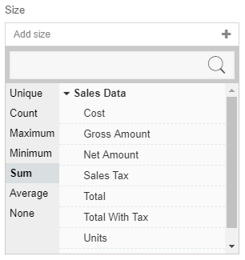

Refer to [single dimension binding](#single-dimension-binding). Measurement binding has aggregate operators like `None`, `Sum`, `Avarage`, etc. that help you group your raw data.

```html
<quadrant-control params="
    controlType: 'singleBinding',
    labelKey: 'Size',
    addLabelKey: 'Add size',
    bindingType: 'measurement',
    selectedConnectionSource : selectedConnectionSource,
    selectedBindingContext: sizePathBindingContext,
    addBinding : addSizePath,
    deleteBinding: deleteSizePath,
    updateBinding: updateSizePath">
</quadrant-control>
```

```javascript
var observable = ko.observable;
var computed = ko.computed;
var getBindingName = fxUtil.bindingName;
var bindingPropertyType = fxUtil.bindingPropertyType;
var fxUnwrap = fxUtil.unwrap;
var isMeasurement = fxUtil.isMeasurement;

var fxQuadrant = params.quadrantViewModel;
var refreshQuadrant = fxQuadrant.refreshQuadrant;
var quadrantComposer = fxQuadrant.quadrantComposer;
var projectionEntityManager = quadrantComposer.projectionEntityManager;
var koProjections = projectionEntityManager.entities;
var koSource = quadrantComposer.source;
var koVisual = quadrantComposer.visual;

var koMeasurements = koProjections.filter(isMeasurement);
var projectionEntityManagerPush = projectionEntityManager.push.bind(projectionEntityManager);
var projectionEntityManagerUpdate = projectionEntityManager.replace.bind(projectionEntityManager);
var projectionEntityManagerDelete = projectionEntityManager.deleteNRemove.bind(projectionEntityManager);
var koSizePathBindingContext = observable();

var koSelectedConnectionSource = computed(function () {
    return fxQuadrant.selectedConnectionSource();
});

init();

function init() {
    initValues();
    initEvents();
}

function initValues() {
    var visual = koVisual();
    var parameters = visual.parameters || {};    
    if (parameters.sizePath != undefined)
        convertNSetSizePathToBinding(visual, koMeasurements());
}

function initEvents() {
    projectionsChangeEventSubscription = koProjections.subscribe(function (newProjectionContexts) {
    var source = koSource();
    source.projections = _.map(newProjectionContexts, fxUnwrap);
        refreshQuadrant();
    });
}

function convertNSetSizePathToBinding(visual, measurements) {
    var parameters = visual.parameters;
    var sizePath = parameters.sizePath;
    convertNSetNameToBinding(measurements, sizePath, koSizePathBindingContext);
}

function convertNSetNameToBinding(bindings, bindingName, koObservableObject) {
    var binding = findBindingByName(bindings, bindingName);
    koObservableObject(binding);
}

function findBindingByName(bindings, bindingName) {
    var foundBinding = _.find(bindings, function (binding) {
    var currentBindingName = getBindingName(binding);
        return currentBindingName === bindingName;
    });
    return foundBinding;
}

function addNSetProjection(binding, koObservableObject) {
    var bindingContext = addProjections(binding);
    koObservableObject(bindingContext);
}

function addProjections(binding) {
    var bindingContext = projectionEntityManagerPush(binding);
    if (!isArray(binding))
        return bindingContext[0];
    return bindingContext;
}

function updateProjection(existingBinding, newBinding) {
    existingBinding.isConfiguring(false);
    var bindingContext = projectionEntityManagerUpdate(existingBinding, newBinding);
    return bindingContext;
}

function deleteProjections(binding) {
    projectionEntityManagerDelete(binding);
}

function setSizePath(binding) {
    var visual = koVisual();
    var parameters = visual.parameters;
    var newSizePath = getBindingName(binding);
    parameters.sizePath = newSizePath;
    bindingPropertyType(binding, enumPropertyTypeMeasurement);
}

function addSizePath(binding) {
    setSizePath(binding);
    addNSetProjection(binding, koSizePathBindingContext);
}

function updateSizePath(existingBinding, newBinding) {
    setSizePath(newBinding);
    var bindingContext = updateProjection(existingBinding, newBinding);
    koSizePathBindingContext(bindingContext);
}

function deleteSizePath(binding) {
    var visual = koVisual();
    var parameters = visual.parameters;
    parameters.sizePath = null;
    koSizePathBindingContext(null);
    deleteProjections(binding);
}

var me = this;
$.extend(true, me, {
    // skipped some bindings above...
    selectedConnectionSource: koSelectedConnectionSource,
    sizePathBindingContext: koSizePathBindingContext,
    sizePath: koSizePath,
    addSizePath: addSizePath,
    updateSizePath: updateSizePath,
    deleteSizePath: deleteSizePath
});
```

#### decimal setting
To get an input of a number of digits after decimal point add this to `app.js`
> Note: Refer to [single measurement binding](#single-measurement) as decimal setting is only valid with single measurement binding.

The `const decimalLabelUtils` and `const utils` are used to provide utility functions that is required to run debugging on decimal setting.

```javascript
const decimalLabelUtils = {
    isDeployed: function () {
        const leesa = window.leesa;
        return (leesa && leesa.model && leesa.model.binding);
    },
};
```

Code logic is implemented after `const data`

```javascript
render(quadrant, callback) {
    // some code bindings
    const value = data[0][valuePath];
    var precision = decimalLabelUtils.isDeployed() ? leesa.util.getPrecision(quadrant, valuePath) : 0;
    const displayValue = value.toFixed(precision);
    // css style code below
    }
``` 
Variable 'precision' will store the number of decimal from your measurement binding pathName.
The 'precision' variable is needed to be used as it is the logic to use to format your bindings for decimal setting in app.js.

#### multiple paths binding
- `addDimensionLabelKey ` defines the placeholder label in the control before anything gets selected.
- `addMeasurementLabelKey` defines the placeholder label in the control before anything gets selected.

> Notes: If either dimension or measurement binding is not needed, exclude its respective functions.

```html
<quadrant-control params="controlType: 'multiBinding',
                                        labelKey: 'qpColumns',
                                        addDimensionLabelKey: 'qpAddDimensionColumns',
                                        addMeasurementLabelKey: 'qpAddMeasurementColumns',
                                        selectedConnectionSource : selectedConnectionSource,
                                        bindings: columnsBindingContexts,
                                        addDimensionBinding : addDimensionColumn,
                                        addMeasurementBinding : addMeasurementBindingFunction,
                                        deleteBinding: deleteColumns,
                                        updateBinding: updateColumns>
</quadrant-control>
```

```javascript
//#region shorthand
var getBindingName = fxUtil.bindingName;
var bindingChartDisplayName = fxUtil.bindingChartDisplayName;
var bindingPropertyType = fxUtil.bindingPropertyType;

//#region private properties
var projectionEntityManager = quadrantComposer.projectionEntityManager;
var projectionEntityManagerPush = projectionEntityManager.push.bind(projectionEntityManager);

//#region public properties
var addMeasurementBindingFunction = (!koIsLiveSource())
    ? addMeasurementColumn
    : null;

function addDimensionColumn(binding) {
    checkBlankSuggestion();
    setColumns(binding, enumPropertyTypeDimension);
    addNPushProjections(binding, koColumnsBindingContexts);
}
function addMeasurementColumn(binding) {
    checkBlankSuggestion();
    setColumns(binding, enumPropertyTypeMeasurement);
    addNPushProjections(binding, koColumnsBindingContexts);
}

function checkBlankSuggestion() {
    var projections = koProjections();
    if (projections.length > 0)
        return;
    var visual = koVisual();
    visual.columns = [];
}

function setColumns(binding, propertyType) {
    var visual = koVisual();
    var newColumnPath = getBindingName(binding);
    var newTitle = bindingChartDisplayName(binding);;
    visual.columns.push({
        dType: "textGridColumn",
        header: newTitle,
        valuePath: newColumnPath
    });
    bindingPropertyType(binding, propertyType);
}

function deleteColumns(binding) {
    var visual = koVisual();
    var deletedColumnPath = getBindingName(binding);

    //currently will always remove the 1st match column in visual
    var matchedColumn = _.find(visual.columns, function (column) {
        return column.valuePath === deletedColumnPath;
    });
    visual.columns = _.reject(visual.columns, function (column) {
        return column === matchedColumn;
    });

    deleteProjections(binding);
    koColumnsBindingContexts.remove(binding);
}

function updateColumns(existingBinding, newBinding) {
    var visual = koVisual();
    var columns = visual.columns;
    var originColumnPath = getBindingName(existingBinding);
    var newColumnPath = getBindingName(newBinding);
    var newTitle = bindingChartDisplayName(newBinding);
    var originBindingPropertyType = existingBinding.bindingType;

    var columnIndex = _.indexOf(_.pluck(columns, 'valuePath'), originColumnPath);
    columns[columnIndex].valuePath = newColumnPath;
    columns[columnIndex].header = newTitle;
    bindingPropertyType(newBinding, originBindingPropertyType);

    var newBindingContext = updateProjection(existingBinding, newBinding);
    koColumnsBindingContexts.replace(existingBinding, newBindingContext);
}

function addNPushProjections(binding, koObservableArrayObject) {
    var bindingContext = addProjections(binding);
    koObservableArrayObject.push(bindingContext);
}

function addProjections(binding) {
    var bindingContext = projectionEntityManagerPush(binding);
    //User pass in single object, single object will be return as well
    if (!isArray(binding))
        return bindingContext[0];

    bindingContext.bindingType = bindingPropertyType(bindingContext.entity);
    return bindingContext;
}

function deleteProjections(binding) {
    projectionEntityManagerDelete(binding);
}

var me = this;
$.extend(true, me, {
    // skipped some bindings above...
    columnsBindingContexts: koColumnsBindingContexts,
    addDimensionColumn: addDimensionColumn,
    addMeasurementColumn: addMeasurementColumn,
    addMeasurementBindingFunction: addMeasurementBindingFunction,
    updateColumns: updateColumns,
    deleteColumns: deleteColumns,
});

```

>Notes: Example of multiple paths binding can refer to data matrix chart in GIANT.

#### separator

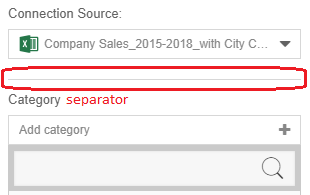

The horizontal line between the quadrant controls.

```html
<hr class="quadrant-properties__seperator">
```

#### textbox

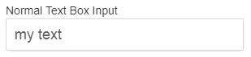

Make sure that you have `normalTextBoxInput` binding exported in the `viewModel`.

```html
<div class="quadrant-properties_databind-content">
    <div class="quadrant-properties__label">Normal Text Box Input</div>
    <div class="quadrant-properties_databind-item">
        <div class="quadrant-properties___text">
            <input type="text" style="width: 100%" data-bind="value: normalTextBoxInput">
        </div>
    </div>
</div>
```

```javascript
var refreshQuadrant = fxQuadrant.refreshQuadrant;

var koNormalTextBoxInput = ko.observable().extend({ rateLimit:600 });

function initValues() {
    var visual = koVisual();
    var parameters = visual.parameters || {};
    if (parameters.yourTextProperties)
        koNormalTextBoxInput(parameters.yourTextProperties);
}

function initEvents() {
    koNormalTextBoxInput.subscribe(function(newValue) {
        var visual = koVisual();
        var parameters = visual.parameters;
        parameters.yourTextProperties = newValue;
        refreshQuadrant();
    });
}

var me = this;
$.extend(true, me, {
    // skipped some bindings above...
    // observables
    normalTextBoxInput: koNormalTextBoxInput
});
```

#### select/drop down list

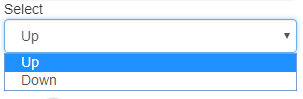

```html
<div class="sandbox__row">
    <div class="sandbox__label">Select</div>
    <div class="quadrant-properties_dropdown-list-container">
        <drop-down-list params="items: selectItems, selectedItem: mySelect"></drop-down-list>
    </div>
</div>
```

```javascript
var refreshQuadrant = fxQuadrant.refreshQuadrant;

var koSelectItems = ko.pureComputed(function(){
    var options = [];
    //name is the display name show in the drop down list
    //value is the key value of the option
    options.push({ name: "Up", value: "up" });
    options.push({ name: "Down", value: "down" };
    return options;
});

var koMySelect = ko.observable();

function initValues() {
    var visual = koVisual();
    var parameters = visual.parameters || {};
    if (parameters.yourSelectProperties) {
        var selectedItem = findOptionByValue(koSelectItems(), parameters.yourSelectProperties);
        koMySelect(selectedItem);
    }
}

function initEvents() {
    koMySelect.subscribe(function(newSelect) {
        var visual = koVisual();
        var parameters = visual.parameters;
        parameters.yourSelectProperties = newSelect.value;
        refreshQuadrant();
    });
}

function findOptionByValue(options, value) {
    for (var i in options) {
        if (options[i].value == value)
            return options[i];
    }
    return null;
}

var me = this;
$.extend(true, me, {
    // skipped some bindings above...
    // observables
    selectItems: koSelectItems,
    mySelect: koMySelect
});
```

#### switch

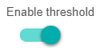

```html
<div>
    <div class="quadrant-properties__label">Enable threshold</div>
    <div class="quadrant-properties__databind-item">
        <switch params="value: isThresholdEnabled, isLabelVisible: false"></switch>
    </div>
</div>
```

```javascript
var refreshQuadrant = fxQuadrant.refreshQuadrant;

var koIsThresholdEnabled = ko.observable().extend({ rateLimit:600 });

function initValues() {
    var visual = koVisual();
    var parameters = visual.parameters || {};
    if (parameters.yourBooleanProperties != undefined)
        koIsThresholdEnabled(parameters.yourBooleanProperties);
}

function initEvents() {
    koIsThresholdEnabled.subscribe(function(newValue) {
        var visual = koVisual();
        var parameters = visual.parameters;
        parameters.yourBooleanProperties = newValue;
        refreshQuadrant();
    });
}

var me = this;
$.extend(true, me, {
    // skipped some bindings above...
    // observables
    isThresholdEnabled: koIsThresholdEnabled
});
```

#### top-bottom-filter
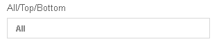
```html
<quadrant-control params="controlType: 'topBottom',
                          quadrantComposer: quadrantComposer,
                         selectedConnectionSource: selectedConnectionSource">
</quadrant-control>
```

#### sort
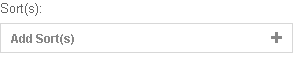
```html
<quadrant-control params="controlType: 'sorting',
                          quadrantComposer: quadrantComposer,
                          selectedConnectionSource : selectedConnectionSource">
</quadrant-control>
```

#### filter
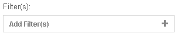
```html
<quadrant-control params="controlType: 'multiCondition',
                          quadrantComposer: quadrantComposer,
                          selectedConnectionSource: selectedConnectionSource,">
</quadrant-control>
```

#### cross chart filter
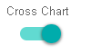
```html
<quadrant-control params="controlType: 'filterSubscriber',
                          quadrant: quadrant">
</quadrant-control>
```
- To publish the selected data using cross chart, use the below code in `app.js`
    ```javascript
    export default {
        extend(quadrant) {
            $.extend(true, quadrant, {
                selectedDataPoint: ko.observable();
            });
        },
        render(quadrant, callback) {
        //More codes above
        const { namePath } = parameters;
        
        //More codes

        //This is to get the selected value that you want to share across your charts. You can get the value in your own way for your visual
        var selectedDropDown = d3DropDownList.property("value");
        //To get the binding of the path (required by createInclusionCondition)

        //This condition is used to publish and unpublish the selected data across your charts 
        if(leesa && leesa.model && leesa.model.binding) {
            
            if(quadrant.selectedDataPoint == selectedDropDown){
                unpublishCrossChart(namePath, quadrant)
            }
            else{
                publishCrossChart(namePath, selectedDropDown, quadrant);
            }
        }

        //more codes below
        //arrayOfValuesForPublish in most cases is equal to selectedDropDown
        function publishCrossChart(namePath, arrayOfValuesForPublish, quadrant) {
            //leesa is giant function
            var bindingModel = leesa.model.binding;
            var binding = quadrant.getBinding(namePath);
            //create inclusion condition is used to create the condition to be publish to all the chart
            var createInclusionCondition = bindingModel.createInclusionCondition; 

            //pass the bindingPath and selected value to create the inclusionCondition
            var inclusionCondition = createInclusionCondition(arrayOfValuesForPublish, binding);
            
            //set the selecteDataPoint to selectedDropDown to use it when unpublish
            quadrant.selectedDataPoint(selectedDropDown);

            //quadrant.publishCondtiion is to publish the condition and filter all the charts based on the conditions.
            quadrant.publishCondition(inclusionCondition);
        }

        function unpublishCrossChart(namePath, quadrant) {
            var bindingModel = leesa.model.binding;
            var binding = quadrant.getBinding(namePath);
            //create inclusion condition is used to create the condition to be publish to all the chart
            var createInclusionCondition = bindingModel.createInclusionCondition; 

            //pass the bindingPath and previously selected to create the inclusionCondition
            var inclusionCondition = createInclusionCondition(quadrant.selectedDataPoint(), binding);

            //publish the condition to unfilter the condition
            quadrant.publishCondition(inclusionCondition, true);

            //set the selectedDataPoint to empty 
            quadrant.selectedDataPoint("");
        }
    ```

- To disable default filter subscriber switch (disable other from filtering), use the below code in `quadrant-properties.js`
    ```javascript
        //more codes
        var visualFilterSubscriber = fxUtil.visualFilterSubscriber;
        function viewModel(params) {
            //more codes
            function initValues() {
                var visual = koVisual();
                var parameters = visual.parameters || {};

                //add this code to disable it.
                visualFilterSubscriber(visual, false);

                //more codes
            }
        }
    ```
- Usage of publish condition
    - Filter all the charts by jan when Jan on the drop down list is selected.

    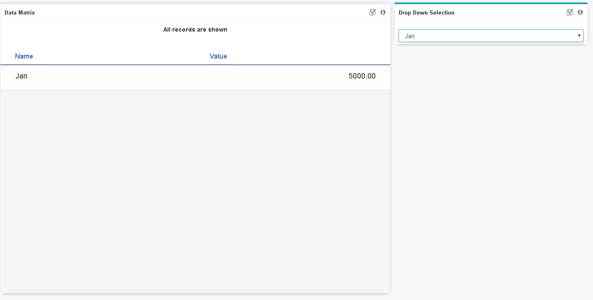

    - Show all the data back when All on the drop down list is selected.
    
    

#### hide header
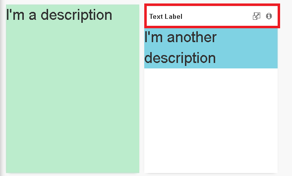
```javascript
function hideHeader(myQuadrant) {
    var localURL = document.URL;
    if (!_.isEmpty(localURL.match(/Workspace/)))
        return;
    
    var container = d3.select(d3.select(myQuadrant).node().closest(".leesa__cell.leesa__cell--noFooter.leesa__cell--grid"));
    
    if (!container.select(".your_visual_class_name").empty()) {
        container.attr("style", "background-color: transparent; box-shadow: none");
        d3.select($(container).closest(".grid-stack-item-content.leesa__flipContainer")[0])
          .attr("style", "background-color: transparent; box-shadow: none");
        container.select(".leesa__header").style("display", "none");
        container.select(".leesa__content").attr("style", "padding-top: 0");
    }
}
```
> Notes: The JS functions to be implemented can be referred from other charts or samples.

#### color palette

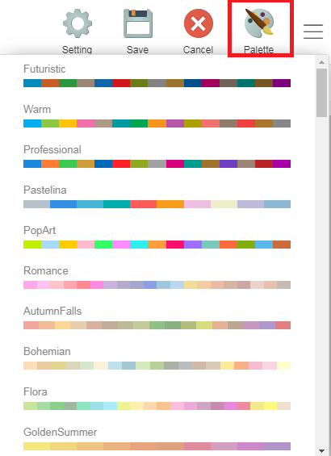

- To use color palette, go to `config.js` file and add `"canConfigureColor": true` in 
```javascript
install: {
    ...//versionfile and output

    visualConfig: {
        ...///groupId, packageId, visualName, displayName
        "canConfigureColor": true
    },
    ...//more codes
}
```
- To use color chosen from the palette, in `app.js` get the colors by `const colors = parameters.color` or `const {colors} = parameters`.
> Notes: colors is an array of color codes.

#### color picker

```html
<div class="colorPicker__label">Your Parameter Name</div>
<div class="myContainerA">
   <div class="colorPicker" data-bind="colorPicker:{colorSelectors:'[]',thresholdColor:yourParameterName},colorPickerContainerClass: 'myContainerA'"></div>
</div>
```

```javascript
var refreshQuadrant = fxQuadrant.refreshQuadrant;

var koYourParameterName = ko.observable();


function initValues() {
    var visual = koVisual();
    var parameters = visual.parameters || {};

    if (parameters.yourParameterName != undefined)
        koYourParameterName(parameters.yourParameterName);
}

function initEvents() {
    koYourParameterName.subscribe(function (newValue) {
        var visual = koVisual();
        var parameters = visual.parameters;
        parameters.yourParameterName = newValue;
        refreshQuadrant();
      });
}

var me = this;
$.extend(true, me, {
    // skipped some bindings above...
    // observables
    yourParameterName: koYourParameterName
});
```

#### drill down
In quadrant-properties.html
```html
<!-- Add new function excludedBindings to your dimensionBindings (f.e. categoryPath)
This function is used to exclude bindings that you already use for drill down from yourPath
-->
<quadrant-control params="  controlType: 'singleBinding',
                            labelKey: 'Category',
                            addLabelKey: 'Category',
                            bindingType: 'dimension',
                            selectedConnectionSource : selectedConnectionSource,


                            excludedBindings: excludedDimensionBindings,


                            selectedBindingContext: categoryPathBindingContext,
                            addBinding : addCategoryPath,
                            deleteBinding : deleteCategoryPath,
                            updateBinding : updateCategoryPath">
</quadrant-control>

//add quadrant control for drill down (hierarchyBinding)
<div class="quadrant-properties__seperator"></div>
<quadrant-control params="controlType: 'hierarchyBinding',
                          selectedConnectionSource : selectedConnectionSource,
                          excludedBindings: excludedDimensionBindings,
                          hierarchyBindingContexts: hierarchyPathBindingContexts,
                          addHierarchy : addHierarchy,
                          deleteHierarchy: deleteHierarchy,
                          updateHierarchy: updateHierarchy">
</quadrant-control>
```

In quadrant-properties.js
```javascript
//declare observableArray
const observableArray = ko.observableArray;

var fxUtilQuadrant = fxUtil.quadrant;
var getHierarchyBindingContexts = fxUtilQuadrant.getHierarchyBindingContexts;
var removeInvalidHierarchyPaths = fxUtilQuadrant.removeInvalidHierarchyPaths;

function viewModel(params){
    var koHierarchyPathBindingContexts = observableArray();

    var koExcludedDimensionBindings = pureComputed(function () {
      var categoryPathBindingContext = koCategoryPathBindingContext();
      var hierarchyPathsBindingContexts = koHierarchyPathBindingContexts();

      var bindings = categoryPathBindingContext ? [categoryPathBindingContext] : [];

      if (categoryPathBindingContext)
      excludedBindings.push(categoryPathBindingContext);

      return bindings.concat(hierarchyPathsBindingContexts);
  });

// more code here 
function initValues() {
      var visual = koVisual();

      //more code here
      
      removeInvalidHierarchyPaths(visual, koDimensions());
      convertNSetHierarchyPathsToBindings(visual, koDimensions());
    }

function convertNSetHierarchyPathsToBindings(visual, dimensions) {
        var hierarchyBindingContexts = getHierarchyBindingContexts(visual, dimensions);
        koHierarchyPathBindingContexts(hierarchyBindingContexts);
    }

//add new logic to function setCategoryPath or the path you want to drill down
function setCategoryPath(binding) {
      //setCategoryPath default logic
      var visual = koVisual();
      var parameters = visual.parameters;
      var newCategoryPath = getBindingName(binding);
      parameters.categoryPath = newCategoryPath;

      //extra logic for correct hierarchy
      visual.currentPath = newCategoryPath;
      if (visual.hierarchyPaths)
          visual.hierarchyPaths[0] = newCategoryPath;

      bindingPropertyType(binding, enumPropertyTypeDimension);
    }

//new functions to manage hierarchy
function addHierarchy(binding) {
      var visual = koVisual();
      var newHierarchy = getBindingName(binding);
      var parameters = visual.parameters;
      if (!visual.hierarchyPaths)
          visual.hierarchyPaths = [parameters.categoryPath];
      visual.hierarchyPaths.push(newHierarchy);

      bindingPropertyType(binding, enumPropertyTypeDimension);

      var bindingContext = addProjections(binding);
      koHierarchyPathBindingContexts.push(bindingContext);
    }

function updateHierarchy(existingBinding, newBinding) {
        var visual = koVisual();
        var hierarchyPaths = visual.hierarchyPaths;
        var originHierarchy = getBindingName(existingBinding);
        var newHierarchy = getBindingName(newBinding);

        var hierarchyIndex = _.indexOf(hierarchyPaths, originHierarchy);
        hierarchyPaths[hierarchyIndex] = newHierarchy;
        bindingPropertyType(newBinding, enumPropertyTypeDimension);

        var bindingContext = updateProjection(existingBinding, newBinding);
        koHierarchyPathBindingContexts.replace(existingBinding, bindingContext);
    }

function deleteHierarchy(binding) {
        var visual = koVisual();
        var deletedHierarchy = getBindingName(binding);

        visual.hierarchyPaths = _.reject(visual.hierarchyPaths, function (hierarchyPath) {
            return hierarchyPath === deletedHierarchy;
        });

        //remove hierarchy if only contain 1 level
        if (visual.hierarchyPaths.length <= 1)
            visual.hierarchyPaths = null;

        deleteProjections(binding);
        koHierarchyPathBindingContexts.remove(binding);
    }

$.extend(true, me, {
      quadrantViewModel: fxQuadrant,
      // more properties here
      hierarchyPathBindingContexts: koHierarchyPathBindingContexts,
      excludedDimensionBindings: koExcludedDimensionBindings,

      addHierarchy: addHierarchy,
      updateHierarchy: updateHierarchy,
      deleteHierarchy: deleteHierarchy
      });

    return;
  }
```
In app.js
```javascript
function getProperties(quadrant) {

  const runtimeConfiguration = {
    jContent: quadrant.htmlJContent(),
    data: quadrant.data(),
    parameters: quadrant.visual().parameters,

    //add new configuration for your visual
    visual: quadrant.visual()
  };

  return runtimeConfiguration;
}

export default {
  extend(quadrant) {
    //add iDrillableSupport for your path
    if (leesa && leesa.visual && leesa.visual.iDrillable)
      leesa.visual.iDrillable.extend(quadrant, {xPath: "categoryPath"});
  },
  render(quadrant, callback) {
      //change yourBindingPath (categoryPath) declaration so that it will get value from visual.currentPath 
      const { data, parameters, jContent, visual } = getProperties(quadrant);
      const { valuePath, colors } = parameters;
      const categoryPath = visual.currentPath;

      //more code here

      //Add drill down call for your event listener
      //Note: each chart has its own way to create event listener
      series.slices.template.events.on("hit", function (event) {
      if (leesa && leesa.model && leesa.model.binding) {
        var categoryValue = event.target.dataItem.category;
        var bindingModel = leesa.model.binding;
        var binding = quadrant.getBinding(categoryPath);
        var createInclusionCondition = bindingModel.createInclusionCondition;
        var inclusionCondition = createInclusionCondition(categoryValue, binding);
        if (quadrant.drillDown(inclusionCondition))
          quadrant.addOrReplaceCondition(inclusionCondition);
      }
    });
```
