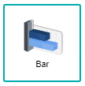

## Column and Bar Chart

 

A Column/Bar chart is a representation of categorical data with rectangular bars with height/length that is proportional to the values being plotted. They are both the same in the sense that the data would be displayed in a rectangular format, but their only differences is the orientation of the graph, being either horizontal(Bar Chart) or vertical(Column Chart), thus making the data sources very interchangable among the two. These two charts are generally used to display a large number of data sets on the category axis, where it makes it easier analysts to learn patterns for creating future predictions for their respective projects.

## Data Binding

For both column and bar charts, there are only two mandatory bindings to generate the chart which are the **X-Axis** and **Y-Axis**. THe **Group** field binding is optional, depending on the analysis that needs to be performed, refer below for the field bindings:

|Bindings|Data Type|
|---|---|
|X-Axis|Text or Date|
|Y-Axis|Numeric|
|Group|Category(Text or Date)|

### X-Axis

A field with Text or Date data type can be used for **X-Axis** binding. This will be displayed as the Category values.

### Y-Axis

A field with Numeric data type can be used for **Y-Axis** binding. This will display the measurement of the values.

### Group

The **Group** binding determines the category to use to group **X-Axis** values in the chart. It can be a Date, Text or Numeric data type.

## Other Settings

### All/Top/Bottom

By default, the option selected is All (which means, all the data points will be shown in the chart). Select Top or Bottom, followed by the number of data points required to show the selected number of top-most data rows **OR** selected number of bottom-most data rows.

### Drill Down

If your data contains hierarchy (for example: Region > Country > State), you can use this field to drill down your data from the highest level to the lower levels.

### Sort

You can use this setting to arrange your data points based on the field that you need. For example, to sort by Country in ascending order.

### Filter

Add filters to restrict your data so that analysis will be focused on data which are shown in the chart.

## Use Cases
### Mastercard's Top 5 Destination Cities in 2019 (Bar Chart)
The dataset on this use case was created by Mastercard to keep track on the top 5 destination cities in 2019, having the values of cities and total international visitors (in millions). A bar chart will be used to display the data. Download sample data [here](./sample-data/column-bar-chart/mastercard-topdestination.csv).

Provided within the dataset are the necessary fields needed to generate the bar chart. The **City** field is used for the **X-Axis** field, and the **Total International Visitors (Millions)** field is placed in the **Y-Axis** field.

|Bindings |Select|
|---|---|
|X-Axis|City|
|Y-Axis|Number of Oversea Client (Millions)|
|All/Top/Bottom|Set to *Top* with the value of **5**|

*NOTE:* The **All/Top/Bottom** setting is set to 5 as the use case is meant to show the Top 5 Destinations

From the chart analysis, it is easily visible that Bangkok is the city with the highest rate of international visitors (22.79 million), where it has a difference of 3.69 million visitors compared to the second highest, which is Paris with the value of 19.1 million visitors. This creates the assumption of Bangkok becoming an important contender among other cities that promote tourism, where Mastercard could also take note on promoting their services within the countries that have a ton of potential customers.

**Output**

>*NOTE:* Remember to sort out the chart in the order of Y-Axis > X-Axis **AND** Y-Axis (Decreasing) to generate the same output as below

### Most Common Items Sold by Store Location (Column Chart)
A sample dataset is used to display the most common items sold compared to its store location. A column chart will be used to display the data. Download sample data [here](./sample-data/column-bar-chart/sample_sales_supplies.xlsx).

Below are the fields used for the data binding to generate the chart:

|Bindings |Select|
|---|---|
|X-Axis|Store Location|
|Y-Axis|Items Sold|
|Group|Item Name|

Displayed within the chart, a display of the most common items sold at different stores, where multiple columns are created at different points of the X-Axis are to be understood as the different Store Locations, whereas the different colour of columns are be understood as the different Item Names.

**Output**

**Analysis**

The conclusion of the use case chart for Most Common Items Sold by Store Location displays the number of items bought within all stores, where the item with the highest number of said purchases are Notepads. Another note to point out is that the items with the least amount of purchases in all stores is Printer Paper and Laptop. The reasoning behind the number of purchases happen could range from the price of the product, the availability of the product, or even the market demand of the product. The store managers could create a plan of action to start creating promotions on the products with the least number of sales to increase their overall revenue.
