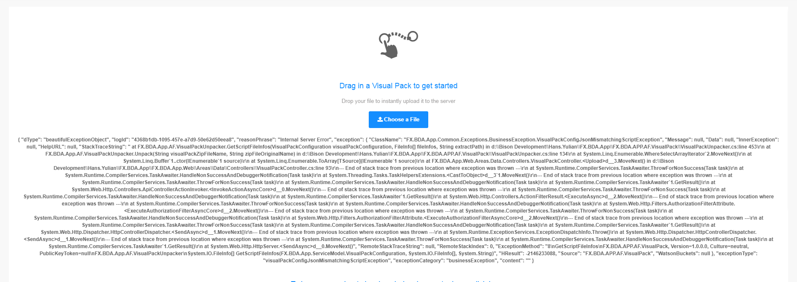
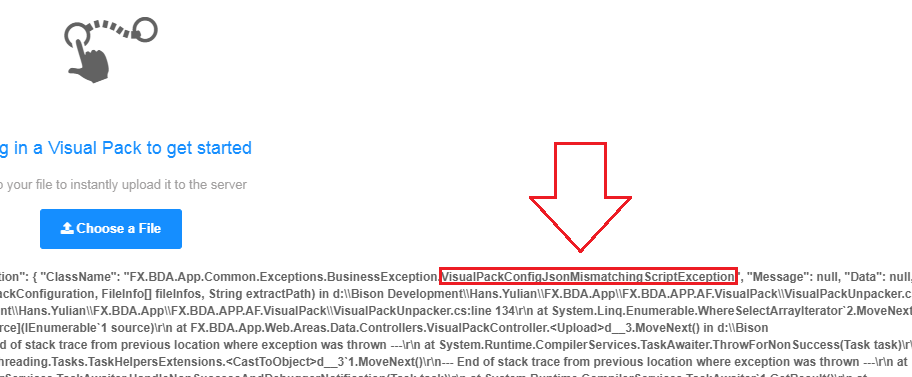

# Visual Pack Exceptions

When uploading a visual pack, there are some possibilities that exception might occur. This is one of the example of exception when uploading a visual pack:



The type of exception is described after ```FX.BDA.App.Common.Exceptions.BusinessException```, for example:



Use the type of exception to lookup for description and possible solution as follow:

| Type | Description | Solution |
| - | - | - |
| VisualPackConfigJsonNotFoundException| Unable to find ```config.json``` file | please check the visual pack, make sure that the ```config.json``` file is exists in the root of zip file| 
| VisualPackConfigJsonInvalidException| ```config.json``` file is found, but the content is not a valid JSON format | make sure that the ```config.json``` file containing a proper JSON configuration | 
| VisualPackConfigJsonRequiredPropertiesNotFoundException| some mandatory property in ```config.json``` file | please check your ```config.json``` configuration and make sure all mandatory properties are defined |
| VisualPackConfigJsonMismatchingScriptException | Unable to find some of the file specified in ```scripts``` under ```config.json```|Make sure that all file specified in ```config.json``` exists in the visual pack|
| VisualPackConfigJsonMismatchingStyleException | Unable to find some of the file specified in ```styles``` under ```config.json```|Make sure that all file specified in ```config.json``` exists in the visual pack|
|