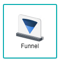

# Funnel Chart
 

Funnel charts are often used to illustrate stages in a process to show anything that is decreasing in size. For example, the funnel chart is typically used to showcase a order fulfillment process or a sales process. Not only that, the funnel chart also helps identify the potential problem areas for an organisation's sales processes.

## Data Binding

For the funnel chart, there are few mandatory bindings to generate the chart which are the **Category Axis** and **Value Axis** properties. For each property, there are specific data types need to fulfill in order for the timeline chart to render correctly, such as can be seen below:

|Bindings|Data Type|
|---|---|
|Category Axis|String|
|Value Axis|Numerical|

### Category Axis

For funnel chart generation, the category axis is generally chosen with the fields that contain a stage-like process.

### Value Axis

For funnel chart generation, the value axis is for the fields that have numbers or numerical data in order for the chart to funnel through from the biggest amount of data to the smallest.

### Filtering

Another setting that could be used is **Filter** where it applies filters to restrict or focus on data shown in the chart.

## Use Cases
### Real Estate Property Activity
A flow on the real estate activities done are documented down within this dataset, where a funnel chart could be used to display the information through a graphical manner. This use case has the necessary fields to create the funnel chart with ease as it has both stages and count. Download sample data [here](./sample-data/funnel-chart/real-estate.xlsx).

To properly generate the funnel chart with the Real Estate dataset given, the user can use the fields that is provided in the dataset, which is **Stages** and **Count**. 

|Bindings|Field to Select|
|---|---|
|Category Axis|Stages|
|Value Axis|Count|

From the diagram, we can see the amount of customers reduce as the process continues, where it starts off with a high number of starting conversations to a small number of closed sales. 

**Output**

### Multiple Sales Channel on Product Purchase Conversion Rates
Current dataset displays the process of multiple sales channels on their product purchase conversion rates.  Although, within the visualised chart below, all five categories are summed up to show the total flow of the sales process on the product purchase. Download sample data [here](./sample-data/timeline-chart/sales-channel-dataset-conversion-rate.csv).

Within the dataset, there are five different fields where the conversion rates are caused through, those being Ads, Media, Affiliates, Referrals and Direct, where each of those have their own number values from top to bottom. The dataset also has the fields for **Stages** and **Total** which will be used for the creation of this chart.

|Bindings|Field to Select|
|---|---|
|Category Axis|Stages|
|Value Axis|Total|

Displayed in the chart below is the total customers that visit the shop, to the amount that actually signs up, to the few that go through the selection process of a product, where they are finally funneled down to a small group that actually purchases the product.

**Output**

**Analysis**

By analysing the chart deeper, the amount of customers are totalled up from the different fields, thus having a summarised view of the whole sales process. From here, managers are able to identify the bottlenecks or potential problem areas within the Product Purchase Conversion Rates funnel chart, giving them an understanding on which process of the chart can be improved upon and be able to evaluate each stage accordingly. 