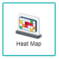
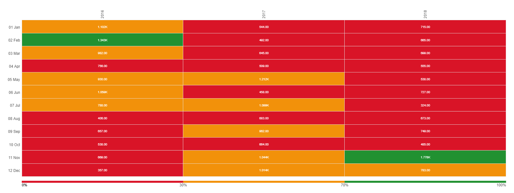
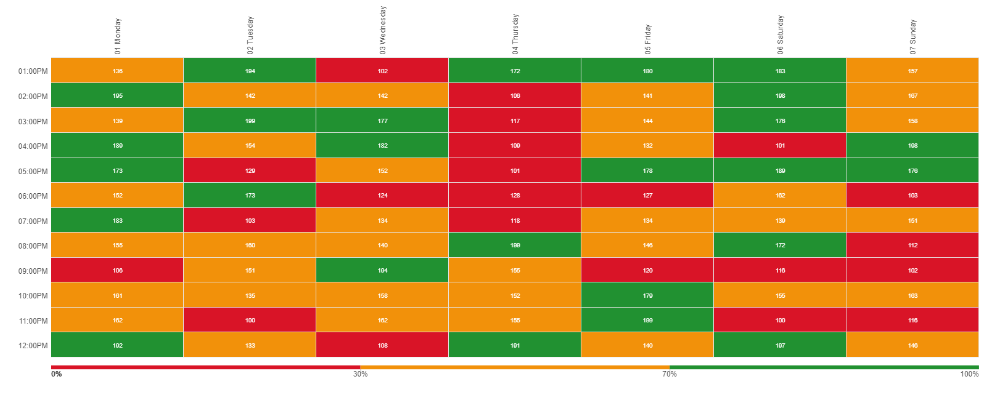

# Heat Map Diagram

A heat map is a visualisation of a matrix where the individual values are depicted by different colours, to show their measurement in an easy to understand manner. The values are displayed by different colours based on the threshold setting, which aids in identifying certain trends. For example, when the trending is set to "Decreasing Better" for a traffic flow dataset, we can identify which hour of the day where the traffic is extremely high (the respective cells will be depicted in Red colour). The heat map is generally used by analysts in order for them to spot trends and benefit from it for decision-making.

## Data Binding

For the heat map diagram, there are a few mandatory bindings to generate the chart which are the **Column**, **Row** and **Measurement** properties. For each property, there are specific data types need to fulfill in order for the combination chart to render correctly, as shown below:

|Bindings|Data Type|
|---|---|
|Column|Text|
|Row|Text|
|Measurement|Numeric|

### Column

A field with text data type can be used for **Column** binding. This will be displayed in the first **Row**, whereby it is used to compare against the **Row** values to create relationship for the **Measurement** values.

Category or Entity values, whereby it represents the origin, beginning or initial flow of a particular data.

### Row

A field with text data type can be used for **Row** binding. This will be displayed in the first **Column**, whereby it is used to compare against the **Column** values to create relationship for the **Measurement** values.

### Measurement

A field with numeric data type can be used for **Measurement** binding. The color of each value within the heat map will change by the comparison among other values, also based on the **Threshold** setting which consists of the:

- Trending (Increasing Better/Decreasing Better)
- Range % of Target

## Other Settings

### All/Top/Bottom

By default, the option selected is All (which means, all the data points will be shown in the chart). Select Top or Bottom, followed by the number of data points required to show the selected number of top-most data rows **OR** selected number of bottom-most data rows.

### Trending

When you have the **Measurement** field binding specified, you can choose the trending value either Increasing Better or Decreasing Better. For example, the trend Increasing Better is used to track Actual Sales vs Target Sales figures. The trend Decreasing Better is used to track the actual number of crime cases reported against the target number of crime cases.

### Range (% of Target)

When you have the **Measurement** field binding, you can specify the threshold for the percentage achievement in this section. The default colours are Red for 0-30%, Yellow for 31-70% and Green for 71-100%.

### Drill Down

If your data contains hierarchy (for example: Region > Country > State), you can use this field to drill down your data from the highest level to the lower levels.

### Sort

You can use this setting to arrange your data points based on the field that you need. For example, to sort by Country in ascending order.

### Filter

Add filters to restrict your data so that analysis will be focused on data which are shown in the chart.

## Use Cases

### Movie Tickets Sold by Carriageworks Theatre
Carriageworks Theatre recorded their data from years 2016 to 2018 on the amount of tickets sold from each month. A Heat Map can be used to display which months have a higher amount in ticket sales according to the years they are sold. Download sample data [here](./sample-data/heat-map/ticketsold-jansep.csv).

Below are the fields used for the data binding to generate the chart:

|Bindings|Field to Select|
|---|---|
|Column|Year|
|Row|Month|
|Measurement|Ticket Sales|

From the heat map, it can be seen that only two Months have a high value on their ticket sales. These respective dates are February 2016 and November 2018, whereas the following months do not have a high enough number of sales when comparing against these two months. By analysing the chart, it can be seen that Carriageworks Theatre only have a short period of 5-6 months on getting steady average sales, this could be due to their intense competition against other theatres on selling movie tickets or that the company only decides to screen specific movies that the audience intends to watch. The management of Carriageworks Theatre could take into consideration for creating strategies on the months that do not have a high ticket sales number to increase their revenue.

**Output**

### Site Visits of Excel Champs By Days of the Week and Hourly Time
This dataset shows a site visit activity of Excel Champs according to the hourly time (after P.M.) and days of the week. Download sample data [here](./sample-data/heat-map/site-visits.xlsx).

From the dataset, the **Day** and **Time** fields will be used for the **Column** and **Row** settings as they are the values used to reflect the relationship between the values. The **Measurement** field is used for giving each value a distinct colour; this shows the amount of site visits within website.

|Bindings |Select|
|---|---|
|Column|Day|
|Row|Time|
|Measurement|Site Visits|

*NOTE: Set the **Decimal** setting within the **Measurement** to be 0.*

From the heat map, it can be seen that some days within the week have a higher site activity rate, along with the time that the site is accessed more, where both values are displayed with a Green colour in contrast to the other colours of Yellow and Red i.e. Monday and Saturday. It can also be seen that Thursday has the lowest customer activity throughout the day as compared to other days.

**Output**

>*NOTE:* The chart generates the **Column** value not according to the days within the week, but alphabetically, thus creating a slight rearrangement within the heat map.

**Analysis**

The conclusion of the use case chart of Site Visits showcases the number user activity within the website according to the time and day, where Saturday states the highest number by having most of its values in Green throughout the day, whereas Thursday states the lowest number by having most of its values in Red throughout the day. Not only that, most of the site visits regularly happen within daytime, as the values from other days are also represented with a Green colour. From this, Excel Champ can create methods of strategy in order to attract users for visiting and interacting with the site more to increase the traffic of the overall website. Further more, Excel Champ also should refer to the Heat Map and check upon why their Thursdays have a low site visit count and should act upon increasing user returnability towards their website.