# Hierarchical Diagram

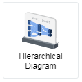    
Hierarchical Diagram is a type of flow diagram that display the data flows with respect to the quantities. A flow diagram  is a diagram that visually displays interrelated information such as events, steps in a process, functions, etc., in an organized fashion, such as sequentially or chronologically. This diagram put a visual emphasis on the major transfers or flows within a system with multiple levels or categories. The thickness of line/link represents the magnitude of the flow. 

## Diagram Design / Configuration
---
### Binding
- The minimum bindings required are 2 dimensions binding and 1 measurement binding.  
    >Source and Target for dimensions and Value for measurement.

    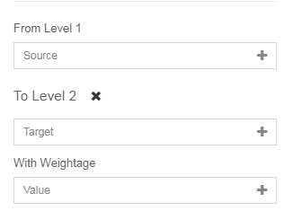

### Configure Level
- Additional level can be added or removed.

    **Add Level**

    

    **Remove Level**

    

### Label Font Size
- Font size of the label in the hierarchical can be set based on input. The accepted unit are all accepted css units (cm, mm, in, px, pt, em).

    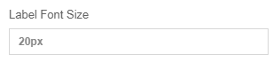

### Level Header Position
- The level header position is the position of the header for each level. There are three options for this: top, bottom or hidden.

    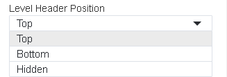

### Display value in percentage
- Calculate the percentage of each link from the source and display it in the link and tooltip.

    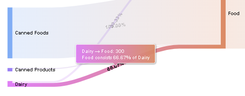

### Fit to container
- If fit to container is turned on, the container will fit to the size of the container. The container height and width can be set by entering your preference height and width with css units. 
    >Set your container height if there are a lot of inputs so that the diagram can be extended.

    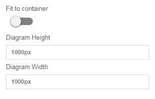

### Sort By
- To rearrange the node either using name or value.

    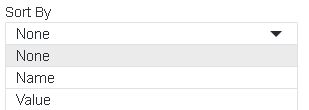

## Use cases
---
### Product Distribution of a Food & Beverage Company

A F&B Company wants to visualize their product distribution across the regions. From the diagram, the company can know the relationship between product group and product line and also the relationship between product line and region. Based on the diagram, we can deduce that Canned food is the major production of this F&B Company where they mostly export their product internationally.

Download sample data [here](./sample-data/hierarchical-diagram/company-product-distribution.csv).

#### Output

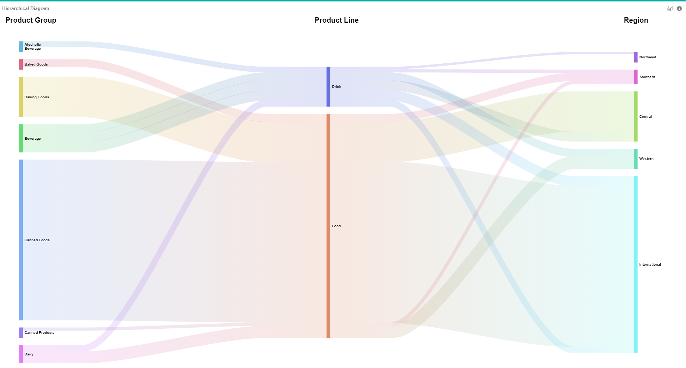

#### Binding
The diagram below shows the data binding for product distribution use case.

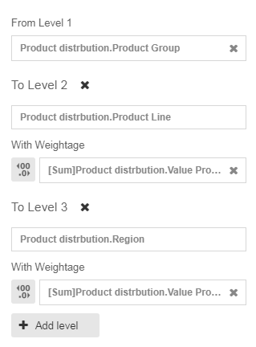

---

### US President Death Reason
A list of US Presidents death reason can be shown using hierarchical diagram. This use case is a typical example of flow diagram usage. From the diagram, we can see that most of the US Presidents were assassinated.

Download sample data [here](./sample-data/hierarchical-diagram/US-president-death-reason.csv).

#### Output

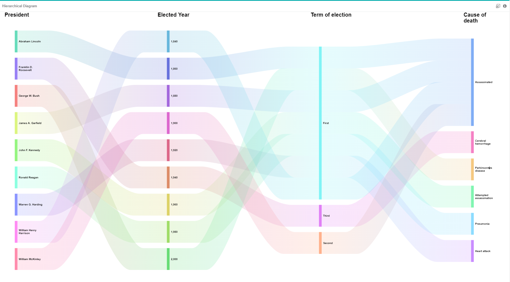

#### Binding

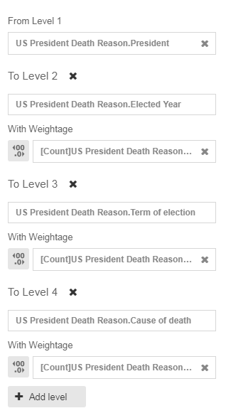
