# Non-Stacked SVG Funnel

## Introduction

     
This document details out the data binding and use cases for Non-Stacked SVG Funnel. Refer [here](./svg-funnel.md) to get an overview of SVG Funnel.

## Data Binding
To get this chart, you need to **disable** the **IsStack** toggle

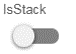

The image below shows the fields related to the chart's data bindings.

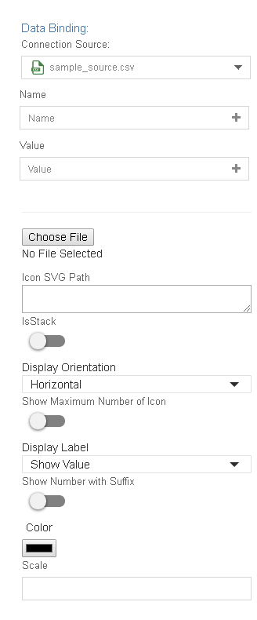

- The required bindings are 1 dimension and 1 measurement.
    > **Name** will be the dimension and **Value** will be the measurement.
- The **Color** field is an optional binding.
- The values from the **Name** field will be shown as the label for each category. The number of icons shown for each category is auto-calculated from the **Value** field binding and the value specified in the **Scale** field. The value from the **Color** field will determine the color of the icon.    
- Upload an SVG image (click on **Choose File** button to do so) or use the **Icon SVG Path** to set the image displayed in the chart.
- You can get the sample SVG [here](./sample-data/svg-funnel/non-stacked-svg/milk-bottle.svg).
    > Copy and paste the svg path to see the below output.
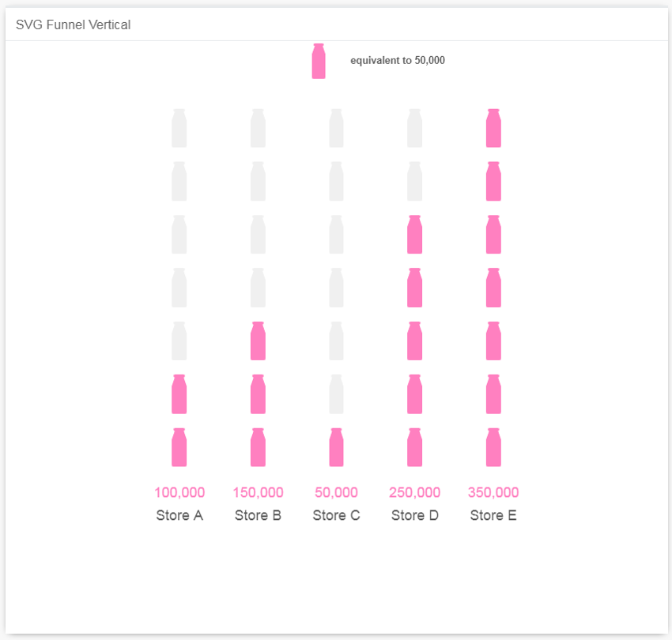

- If **SVG file** is not provided or **Icon SVG Path** not specified, the default human icon will be used.
    > NOTE: If the SVG file is provided, the **Icon SVG Path** will be ignored.
- **Display Orientation**: Select the value to display the icons in **Horizontal** or **Vertical** orientation.
- **Show Maximum Number of Icon**: Enable the toggle to show the maximum number of icons for each Category (it will be the same as the number of icons shown for the category with the highest value).

    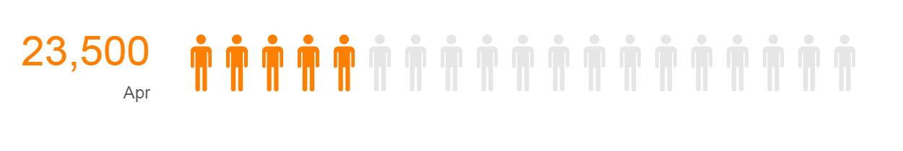

- **Display Label**: Choose to show the actual **Value**, show the value in **Percentage** or show both the **Value and Percentage**.

    Example for **Show Value**
    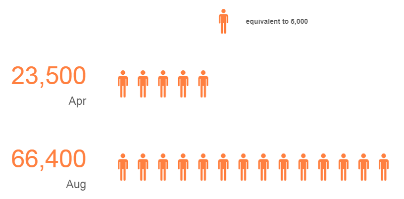

    Example for **Show Percentage**
    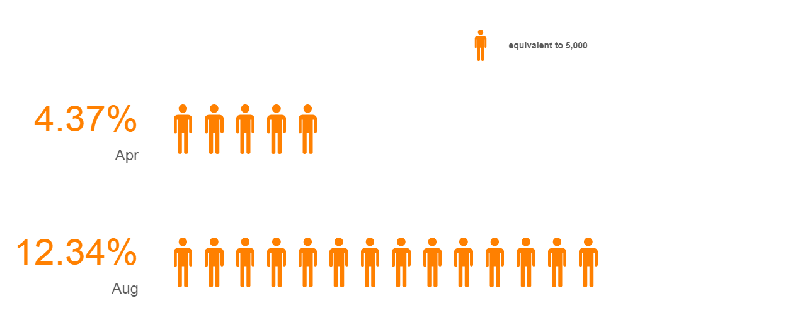

    Example for **Show Value and Percentage**
    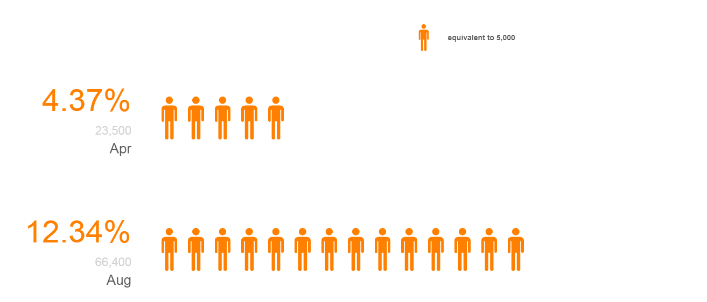
    
- **Show Number with Suffix**: To show large numbers as formatted value (i.e. 1,000,000 will be shown as 1.00M)

    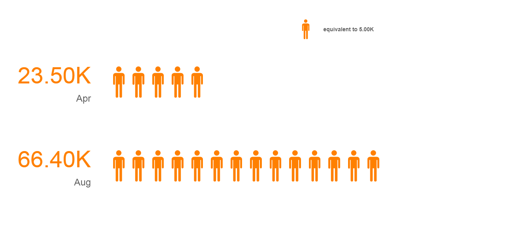

- **Color**: To set the color of the icons.

    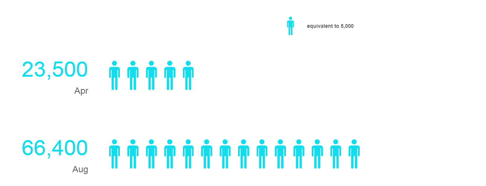

- **Scale**: To set the value represented by one icon (e.g. to set one icon is equal to 8,000 units)

    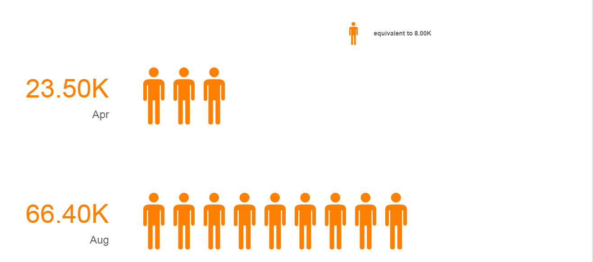

- Here's the Sample Output of the chart with completed data bindings.
    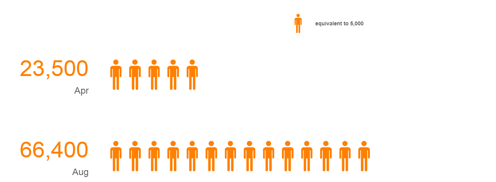

## Use Cases

- ### Quantity of Strawberry Milk Sold
    We can use the SVG Funnel to show the quantity of strawberry milk sold in stores. The pictogram makes it easy to analyse at a quick glance on the quantity sold (in bottles) at each store.
Download sample data [here](./sample-data/svg-funnel/milk-sold.csv). Get the Milk Bottle SVG file [here](./sample-data/svg-funnel/non-stacked-svg/milk-bottle.svg).

    #### Output & Binding
    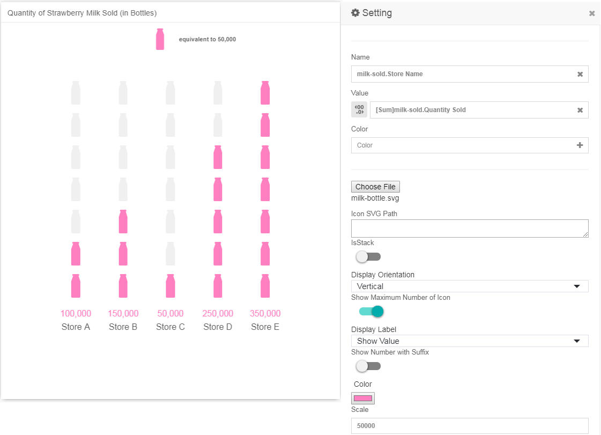

- ### Grade of a Child
    The SVG Funnel can show the number of stars received by a child in kindergarten which corresponds to the child's daily behaviour in a week.
Download sample data [here](./sample-data/svg-funnel/child-grades.csv). Get the Star SVG file [here](./sample-data/svg-funnel/non-stacked-svg/star.svg).

    #### Output & Binding
    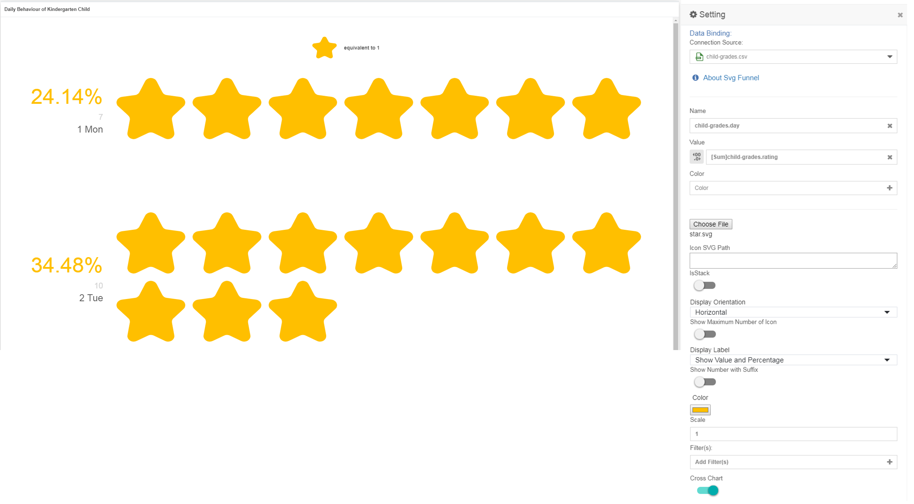
