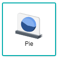

## Pie and Donut Chart

 

A Pie/Donut chart is an illustration of categorical data to give a simple break down on the values being plotted. They are both similar in a sense that their data would be displayed as a circle with percentages, but their only differences is that the chart would be whole (Pie Chart) or has a center cut hole (Donut Chart), thus making the data sources very interchangable among the two. These two charts are used to show the relationship between the categories of the data, where one could see which data could be of more importance when compared to the rest. i.e. Focusing to capitalise on the bigger segments or Placing more effort on smaller segments 

## Data Binding

For each field, specific data type need to be fulfilled in order for the chart to render correctly, as shown below:

|Bindings|Data Type|
|---|---|
|Category|Text|
|Value|Numeric|

### Category

A field with Text data type can be used for **Category** binding. This will be displayed as the Category values.

### Value

A field with Numeric data type can be used for **Value** binding. This will display the measurement of the values. Not only that, the values will be presented with through percentages, thus totalling the whole Pie and Donut Charts to always be 100%.

## Other Settings

### All/Top/Bottom

By default, the option selected is All (which means, all the data points will be shown in the chart). Select Top or Bottom, followed by the number of data points required to show the selected number of top-most data rows **OR** selected number of bottom-most data rows.

### Drill Down

If your data contains hierarchy (for example: Region > Country > State), you can use this field to drill down your data from the highest level to the lower levels.

### Sort

You can use this setting to arrange your data points based on the field that you need. For example, to sort by Country in ascending order.

### Filter

Add filters to restrict your data so that analysis will be focused on data which are shown in the chart.

## Use Cases
### 2016 US Presidential Election (Pie Chart)
The 2016 US General Election had documented the total votes amongst 3 candidates, Trump, Clinton, and Johnson throughout their campaigns within the different counties, states of USA. A pie chart will be used to display the data. Download sample data [here](./sample-data/pie-donut-chart/us-election-2016-results-by-county.csv).

Provided within the dataset are the necessary fields needed to generate the pie chart. Although the dataset has several columns to choose from, the only needed fields to generate the chart according to the use case are the **Candidate** field for the **Category** setting, and the **VoteCount** field is placed in the **Value** setting.

|Bindings |Select|
|---|---|
|Category|Candidate|
|Value|VoteCount|

Displayed clearly within the pie chart, there is a split between two candidates, Trump and Clinton, where both of them stand at 48.21% and 48.05% respectively. This shows that the competition among these two candidates were very tight, only by having one candidate having the slight edge against the other. Another point that should be noted is that the candidate, Johnson, takes up 3.94% of votes, meaning that some of the votes could be placed for the other two candidates to give them a slight edge against the other.

**Output**

### Retail Sales by Product Category and Store Type (Donut Chart)
A sample dataset is used to display the most common items sold compared to its store location. A donut chart will be used to display the data. Download sample data [here](./sample-data/pie-donut-chart/retail-sales-by-store-type.xlsx).

Provided within the dataset are the necessary fields needed to generate the donut chart. The **Category** field is used for the **Category** field, and the **Sales** field is placed in the **Value** field.

|Bindings |Select|
|---|---|
|Category|Category|
|Value|Sales|
|Drill Down|Store Type|

Displayed within the chart are the product categories that make up their own segment according to the total sales. In this example, **Women's, juniors' & misses' wear** has the biggest segment size of 47.12% compared to the other categories. Not only that, with the usage of the **Drill Down** binding, clicking on each segment will show the data of the specific Store Type that it was bought from.

**Output**

*Note:* This output shows the **Drill Down** examples for the Store Type on Women's wear. A Drill Down Breadcrumb is available on the top-left of the chart to indicate the Drill Down level currently being displayed

>*NOTE:* Due to the size of the chart, some labels are cut off/extended outside the diagram. Instead, the legend will be used to assist in identifying the segments.

**Analysis**

The conclusion of the use case chart displays the percentage of items bought from each product category and store type, where the **Women's, juniors' & misses' wear** takes up to almost half of the whole sales, with 47.12% across all store types. From the drill down of the largest segment, it is shown that **Clothing & clothing accessories stores** along with **General merchandise stores** contribute the most towards the sales of **Women's, juniors' & misses' wear**. Perhaps, this is due to the fact that there are more product variety sold in general merchandise stores and clothing & accessories stores. From this, the management of the company should use the donut chart as an analysis tool to see which products they should be more focused on, as well as which stores should specialise in selling the said products to eventually gain a higher profit throughout their business year.
