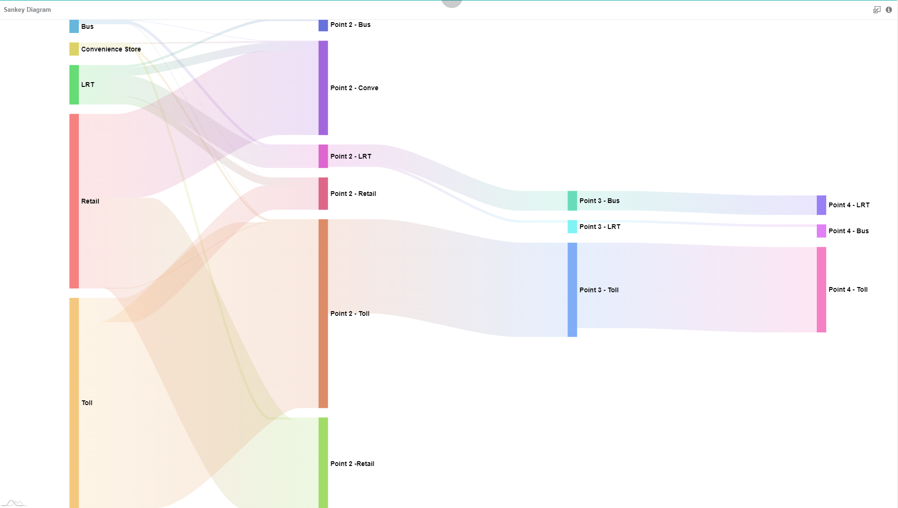

# Sankey Diagram

    
Sankey diagram displays the data flows and the respective quantities. This chart is typically used to show flow of money, materials, information and energy. The width of the thread connecting from one point to another shows the relative strength of the flow.

## Diagram Design / Configuration
---
### Binding
- The bindings required are 2 dimensions binding and 1 measurement binding.  
    >Source and Destination for dimensions and Actual for measurement.
      
  
  
- The optional binding is color binding which binds the color of the nodes.

 
 
Sample data download [here](./sample-data/sankey-diagram/annual-finances-of-a-married-couple-color.xlsx).

### Diagram Sort Order
There are three options for this configuration which are *None*, *Name*, *Value*. The default option is *Value*.
- None: Arrange the node based on the arrangement in the data source.
- Name: Arrange the node in ascending alphabetical order.
- Value: Arrange the node in ascending *actual* value.

    

### Show value in percentage
- Calculate the percentage of each link from the source and display it in the link and tooltip. It is used when the value are too large to be analyzed.

    

### Fit to container
- If fit to container is turned on, the container will fit to the size of the container. The container height and width can be set by entering your preference height and width with css units. 
    >Set your container height if there are a lot of inputs so that the diagram can be extended.

    

### Label Font Size
- Font size of the label in the hierarchical can be set based on input. The accepted unit are all accepted css units (cm, mm, in, px, pt, em).

    

## Incompatible data source 
- The data source should not contain 
    - two directions flow, E.g: Kedah -> Perlis, Perlis -> Kedah. 
    - flow that flow back to itself. E.g: Kedah -> Kedah.
- For the above cases, "maximum stack size exceeded" error will be shown. You will see that the setting panel opacity become lower.

 

## Use cases

### eWallet Usage Points   
   
To show the number of users that uses e-wallet payment from Point 1 to the next subsequent points. You will be able to see in which group the majority of users falls into; those that use this payment method only 1-2 times a day or more than 2 times a day, also the journey that the users go through as they use the e-wallet payment system. Based on the diagram, we can conclude that most of the e-wallet users that pay for toll at the initial point will continue to spend on toll and some of them spend on retail store. We can also conclude that users that spend on LRT will spend on bus, convenience store, retail and also continue to spend on LRT.

Sample data download [here](./sample-data/sankey-diagram/ewallet-usage-points.xlsx).

### Annual Finances of A Married Couple   
   
This dataset shows the finance flow of a married couple. It illustrates how their income is managed in terms of expenses and savings, also how the money flows. Based on the diagram, we can conclude that most of the income comes from husband wages and wife wages. We can also conclude that food and insurance consists of most of the expenses.

Sample data download [here](./sample-data/sankey-diagram/annual-finances-of-a-married-couple.xlsx).
