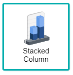
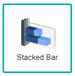
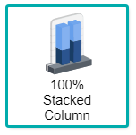
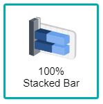
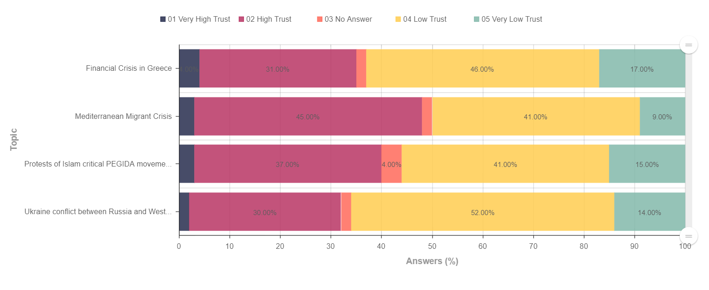
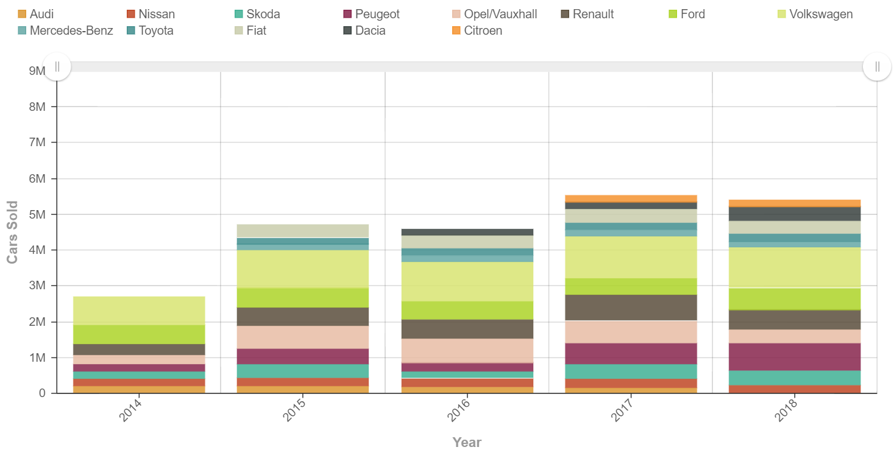

## Stacked/100% Stacked Column and Bar Chart

    

Stacked and 100% Stacked Charts are variations of the Column and Bar charts, whereby the charts combine all columns/bars in a stacked format instead of displaying different the columns/bars of one category on the X-Axis. Essentially, both charts are generated and displayed similarly, but only having the difference of the 100% Stacked Chart showcasing the relative percentage of the columns/bars to always equal 100%. These charts are generally used to avoid the problem of over population that could be created from large data sources. By utilising stacked and 100% stacked charts, the total of a category can easily be summed up due to their nature of grouping categories into one, allowing the display of change over time or across categories.

*NOTE : Click here(**No current link since waiting for branch to be merged to master**) to find out more on Column and Bar chart*

## Data Binding

For both stacked and 100% stacked charts, there are only two mandatory bindings to generate the chart which are the **X-Axis** and **Y-Axis**. However, to analyse both chart properly, the **Group** field should also be binded to fulfill in order for the charts to render correctly, as shown below:

|Bindings|Data Type|
|---|---|
|X-Axis|Text, Date|
|Y-Axis|Numeric|
|Group|Category(Text or Date)|

### X-Axis

A field with Text or Date data type can be used for **X-Axis** binding. This will be displayed as the Category values.

### Y-Axis

A field with Numeric data type can be used for **Y-Axis** binding. This will display the measurement of the values.

### Group

The **Group** binding determines the category to use to group **X-Axis** values in the chart. It can be a Date or Text data type.

## Other Settings

### All/Top/Bottom

By default, the option selected is All (which means, all the data points will be shown in the chart). Select Top or Bottom, followed by the number of data points required to show the selected number of top-most data rows **OR** selected number of bottom-most data rows.

### Drill Down

If your data contains hierarchy (for example: Region > Country > State), you can use this field to drill down your data from the highest level to the lower levels.

### Sort

You can use this setting to arrange your data points based on the field that you need. For example, to sort by Country in ascending order.

### Filter

Add filters to restrict your data so that analysis will be focused on data which are shown in the chart.

## Use Cases
### Trust of German Citizens regarding the Media Reports of 2015 (100% Stacked Bar Chart)
The dataset is based on a survey poll by Infratest dimap, a German Institute to capture the thoughts and feedback of their citizens about their trust on reports made by the media based on the big issues that occurred in 2015. A 100% Stacked Bar chart will be used to display the data. Download sample data [here](./sample-data/stacked-charts/trust_in_media_reporting.xlsx).

Below are the fields required for the data binding to generate the chart according to the dataset that is given, the fields needed to be used are **Topic**, **Answers** and **Trust** respectively:

|Bindings |Select|
|---|---|
|X-Axis|Topic|
|Y-Axis|Answers|
|Group|Trust|

The 100% stacked chart helps in creating a bar which can easily be compared with other values, as the cumulative values of each data will always be displayed at 100%, hence making the rest of the data to also be displayed with a percentage(%) value. From the chart analysis, the majority of citizens answer that they have low trust on each topic of the media report, especially for those which is "Financial Crisis in Greece" and "Ukraine conflict between Russia and Western Countries". This then helps Infratest dimap to make a hypothesis that the media does not have total influence amongst its citizens, where the graph displays that more than half of the topics have a higher percentage of Low Trust as compared to High Trust.

**Output**

>*NOTE:* Remember to sort out the chart in the order of X-Axis > Group > Y-Axis to generate output as below

### Top Car Brands Sold in Europe from 2014 to 2018(Stacked Column Chart)
A datasource is recorded by JATO on the top car brands sold in Europe from the year 2014 to 2018. A Stacked Column chart will be used to display the data. Download sample data [here](./sample-data/stacked-charts/EU-car-brands.csv).

Provided within the dataset are the necessary fields needed to generate the stacked chart. The **Year** field is used for the **X-Axis**, and the **Cars Sold** field is placed in the **Y-Axis** field. For making the chart display the different types of car brands, the field of **Car Model** will be set for the **Group** binding.

|Bindings |Select|
|---|---|
|X-Axis|Year|
|Y-Axis|Cars Sold|
|Group|Car Model|

Displayed within the chart, a display of the the total sales of car brands within the European continent from the year 2014 to 2018. The total sales of car brands are then distributed among each column to display the types of car brands that were sold within the specific year. At glance, it can also be seen that 2017 has the highest number or cars sold as compared to 2014 having the lowest number of cars sold.

**Output**

**Analysis**

The conclusion of the use case chart on the Top Car Brands Sold in Europe from 2014 to 2018 showcases the total car brands sold in and from each year. This means that there can are two things to be analysed, the first being the comparison of sales between each year, which could be easily spotted from the get-go as 2017 has the biggest column as compared to the rest, this can be deduced that 2017 probably could have a bigger marketing campaign by the Car Brands within the European continent, thus having an increase of car sales. The second analysis can be done through the comparison of sales of car brands within each year respectively, whereby the chart displays that the highest sales output comes from Volkswagen, followed by Ford, Renault, and Opel/Vauxhall respectively. This shows that Europeans are more fond of European car brands to be used within their own country, with the only exception of Ford being an American company. By analysing both points thoroughly, car dealerships around Europe could take in account to increase their stock inventory with the cars that have high sales as it could potentially increase in their revenue due to the high demand of specific car brands.