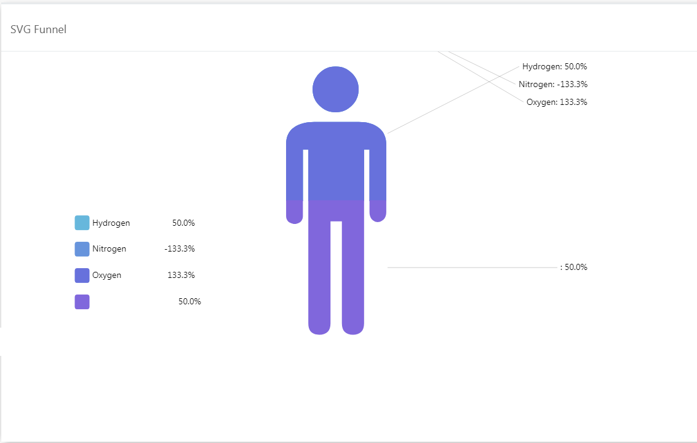

# Stacked SVG Funnel

## Introduction
     
     
This document details out the data binding and use cases for **Stacked SVG Funnel**. Refer [here](./svg-funnel.md) to get an overview of SVG Funnel.

## Data Binding
To get this chart, you need to **enable** the **IsStack** toggle

The image below shows the fields related to the chart's data bindings.

 
- The required bindings are 1 dimension and 1 measurement.
    > **Name** will be the dimension and **Value** will be the measurement.
- The **Color** field is an optional binding.
- The values from the **Name** field will be shown as the label for each category. The area or height of the segments in the image is auto-calculated from the **Value** field binding. The value from the **Color** field will determine the color of each segment.
- You can also use the Color Palette to configure the color of the image. 
    > NOTE: If a valid data binding for the **Color** field is provided, the selected **Color Palette** will be ignored.
    
    
    
- Upload an SVG image (click on **Choose File** button to do so) or use the **Icon SVG Path** to set the image displayed in the chart.

- You can get the sample SVG [here](./sample-data/svg-funnel/sample-svg/sample.svg).
    > Copy and paste the svg path to see the below output.

- If **SVG file** is not provided or **Icon SVG Path** not specified, the default human icon will be used.
    > NOTE: If the SVG file is provided, the **Icon SVG Path** will be ignored.
    
- Here's the Sample Output of the chart with completed data bindings.

## Caveats
- If there is a null value in the **Name** field, it will still show in the chart with only the value .
- If there is a null value in **Value** field, it will not exist in the chart but shown in the legend.
- If there is a negative value, the chart will not function properly.

Examples:   
   
### Caveat 1

### Caveat 2

## Use Cases

- ### Coca Cola Ingredients
    We can use the SVG Funnel to show the ingredients of the Coca Cola drink. We can use the Coca Cola icon to make the visual fascinating and attractive.
Download sample data [here](./sample-data/svg-funnel/coca-cola-ingredients.csv). Get Coca Cola SVG file [here](./sample-data/svg-funnel/coca-cola-svg/coca-cola.svg).

    #### Output & Binding
    

