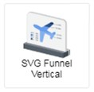

# SVG Funnel

## Introduction

     
The SVG Funnel is a visual that uses an image to represent the categories and values in a chart. There are two types available, depending on the chart mode that you choose for the chart:

**a) Type 1 - Stacked SVG Funnel**   
Stacked SVG Funnel is a spiced up variation of a regular stacked bar or column chart. It uses an image to provide an overview of the categories, represented in segments. Each segment corresponds to the value of each category. Refer [here](./visual/stacked-svg-funnel.md) for more details.

**b) Type 2 - Non-Stacked SVG Funnel**   
Non-Stacked SVG Funnel is a pictograph which shows data using images. A pictograph uses picture symbols to convey the meaning of statistical information. Each picture symbol stands for a certain value. Refer [here](./visual/non-stacked-svg-funnel.md) for more details.

## Visual Configuration   
After selecting the chart to add to your dashboard, you will see the following data binding fields shown in the **Setting** panel:

- **Description**: Fill-in the **description** for the chart in this field.
- **Connection Source**: Specify the data source from which the Categories and Values in chart would be displayed.
- **Name**: Column in the data source which contains the **Category** values.
- **Value**: Column in the data source which contains the **Values** for the Categories.
- **Color**: Colour code to use for the image(s) shown in the Chart (Refer to **Notes** for more info).
- **Choose File**: Choose the SVG image to use in the chart (only SVG format is supported).
- **Icon SVG Path**: Instead of uploading an SVG image, you can specify the image using the SVG Path (Refer to **Notes** for more info) .
- **IsStack**: **Enable** the toggle to get a **Stacked SVG Funnel**, otherwise **disable** the toggle to get a **Non-Stacked SVG Funnel**.   
   
- **Display Orientation**: Applicable for **Non-Stacked SVG Funnel**. Choose either to display the images in **Horizontal** or **Vertical** orientation.
- **Show Maximum Number of Icon**: Applicable for **Non-Stacked SVG Funnel**. **Enable** the toggle to get the **maximum number of icons** shown for each Category (which is the same as the number of icons shown for the category with the highest value).
- **Display Label**: Applicable for **Non-Stacked SVG Funnel**. You can choose to display the **Value**, **Percentage** or both **Value and Percentage**.
- **Show Number with Suffix**: Applicable for **Non-Stacked SVG Funnel**. When you **enable** the toggle, large numbers are shown as **formatted values** (i.e. 100,000 is shown as 100.00K).
- **Color**: Applicable for **Non-Stacked SVG Funnel**. Select the colour to apply to the image.
- **Scale**: Applicable for **Non-Stacked SVG Funnel**. The scale to apply for each image (e.g. one image is equivalent to 10,000 units).   
- **Filter(s)**: Apply **filter** to restrict the data shown in the chart.
- **Cross Chart**: Enable the toggle to turn on the Cross Chart Filter feature for the chart.

## Notes:  
1. Colour Code - This is the list of supported formats for the colour code:

2. SVG Path - Refer [here](https://www.w3schools.com/graphics/svg_path.asp) for more info on SVG Path. Get the sample [here](./sample-data/svg-funnel/sample-svg.txt).

## Pro Tips
- ### When to use Stacked SVG Funnel?   
Recommended when you want to **visualize and analyze the data by composition**.
Similar to pie chart, donut chart and stacked bar/stacked column chart, with the additional feature to customize the image used to visualize the data.

- ### When to use Non-Stacked SVG Funnel?   
Recommended for **qualitative analysis**, when you need to have a quick overview of your data in terms of comparing the values.
Use this chart when showing the exact figures is not that important and showing numerical information using picture symbols is sufficient.
