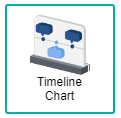
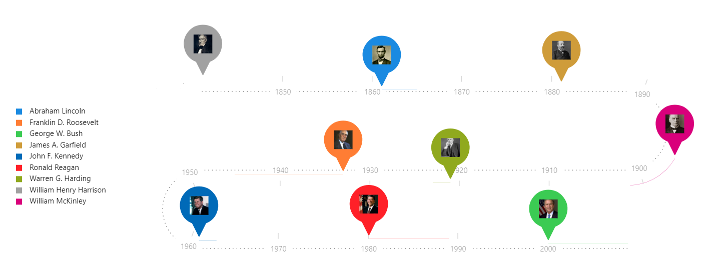
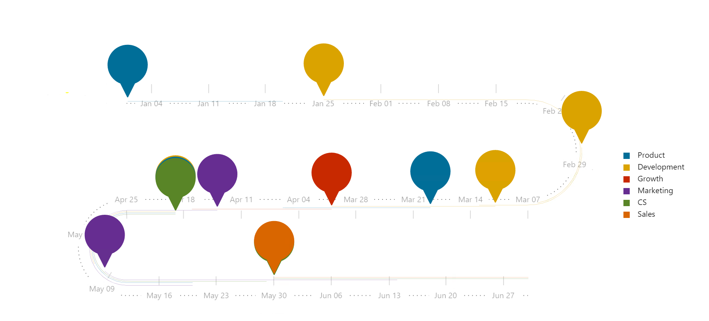

# TimeLine

Timeline Chart is a graphical visualisation of a period of time, where the process is ordered chronologically. Since details are displayed graphically, the most important events can be easily seen and are marked from the start to the end. This chart is typically used for managing a project's schedule, where it adds transparency and gives the chance in analysing what happened in the past to plan for the future.

## Data Binding

For the timeline chart, there are a few mandatory bindings to genearte the chart which are the **Category**, **Start Date** and **End Date** properties. For each property, there are specific data types need to fulfill in order for the timeline chart to render correctly, such as can be seen below:

|Bindings |Data Type|
|---|---|
|Category|String|
|Start Date|Date|
|End Date|Date|

### Category

For timeline chart generation, category is generally chosen with the fields that use a general stage type process, where key milestones could be used as a marker on the chart.

### Start Date

For timeline chart generation, the start date is for the fields that have a date (ShortDate or LongDate) type of data to create a proper start line for the chart.

### End Date

For timeline chart generation, the end date is for the fields that have a date (ShortDate or LongDate) type of data to create a proper end line for the chart.
 
 *NOTE*: Start Date and End Date must be linked to different field columns respectively to avoid errors in the chart creation

## Other Settings

### Tooltips

To indicate what the point markers created what the **Category** binding has set, the **Tool Tip Path** setting will be used to set a description for the legend that will be displayed within the timeline chart.

### Image

If the user has a dataset that stores image or image links, the **Image Path** enables the addition of images onto the timeline chart.
>*NOTE*: If using imagelink, access to internet is required for image to appear on the chart

### Sort

For huge data sets, a setting called **Sort** can be used to alter the timeline chart on different specifics that the user wants to view or create on the chart.

### Filtering

Another setting that could be used is **Filter** where it applies filters to restrict or focus on data shown in the chart.

## Use Cases

### US President Deaths and Terms
A list of USA Presidents term length along with their deaths can be displayed using Timeline Chart. This use case uses a flow that has a start and end date using the year format. Download sample data [here](./sample-data/timeline-chart/US-president-death.xlsx).

As the sample dataset has provided with numerous different fields, the key fields to use are **President**, **Elected Year** and **End Year**. Another field that could be used within the chart is the **Image of President**, as it could be placed to make the images of the presidents appear as the marker within the chart.

|Bindings |Field to Select|
|---|---|
|Category|President|
|Start Date|Elected Year|
|End Date|End Year|
|Tooltips|President|
|Image|Image of President|

>*NOTE*: Since dataset is using imagelink, access to internet is required for image to appear in the chart

From the diagram, we can see that year of when the US president gets elected until the end of their term, due to their deaths.

**Output**

### Project Management Flow on Product Launching
Current dataset displays the project management flow of a product release from the inception of the requirements until the launching of the product. Download sample data [here](./sample-data/timeline-chart/sample-project-mgmt.csv).

On the creation of this timeline chart, the project management flow on product launching use case has four fields that fits nicely to the chart, those being **Task**, **Task Start** and **Task End**. The subtask field could be used to set as a sort to see what task a specific department has completed for within their project timeline.

|Bindings |Select|
|---|---|
|Category|Task|
|Start Date|Task Start|
|End Date|Task End|
|Tooltips|Task|
 
 Displayed in the chart, it can be seen that the six different teams had done multiple different subtasks throughout the whole project. As each subtask having their own Start Date and End Date, each team would reoccur in different points of the timeline. 

**Output**

**Analysis**

By analysing the chart deeper, the tasks and subtasks actual start and end dates are documented, thus giving managers the opportunity to refer to the Project Management timeline chart for future projects on comparing actual and expected deadlines. Adding on, managers can recognise on which team would require more resources to accomplish the tasks in a given deadline. The chart also helps in road mapping future projects for the users whom can refer to it in order to work toward achieving the set goals.