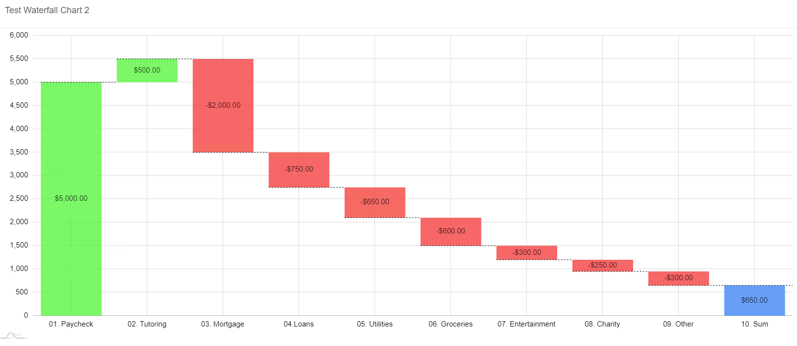

# Waterfall Chart
A waterfall chart is a form of data visualization that helps in understanding the cumulative effect of sequentially introduced positive or negative values. These intermediate values can either be time based or category based. The waterfall chart is also known as a flying bricks chart or Mario chart due to the apparent suspension of columns (bricks) in mid-air. Often in finance, it will be referred to as a bridge.

## Diagram Design / Configuration

### Binding
- The bindings required are Category and Value.

    >Category shows a name for a certain category. 

    >Value stores the amount of income or losses for a certain category

  
Based on binded values that come from Excel Sheet, several required values will be automatically calculated.
* These values are:
    * `Start Value` shows the existing amount before the current category is applied. This value will always be 0 for the first and last columns and is equal to 'End Value' of previuos category. 
    * `End Value` Value reflects the amount after the current category is applied. 'End Value' is a sum of 'Value' and 'Start Value'
    * `Color` binding which binds the color of the nodes. It is always red for negative values, green for positive values and blue for first and last columns.
    * `Display Label` that shows the difference between amounts before and after a category is applied. This is equal to Value.

 
Sample data download [here](./sample-data/waterfall-chart/sampleData1.csv).

## Use cases

### Costs, expenses and operative income  
   
This dataset shows all finance costs, expenses, income and net revenue of a company for a given period of time. We can see that the major expense for the company is a cost of sales, followed by operating expenses.

Sample data download [here](./sample-data/waterfall-chart/sampleData1.csv).

### Monthly Income Chart
   
This dataset shows overall year income based on every month profit and loss. 

Sample data download [here](./sample-data/waterfall-chart/sampleData2.csv).

### Monthly Savings
   
Current dataset displays a person's savings based on one's salary and spending. 

Sample data download [here](./sample-data/waterfall-chart/monthly-savings.xlsx).
